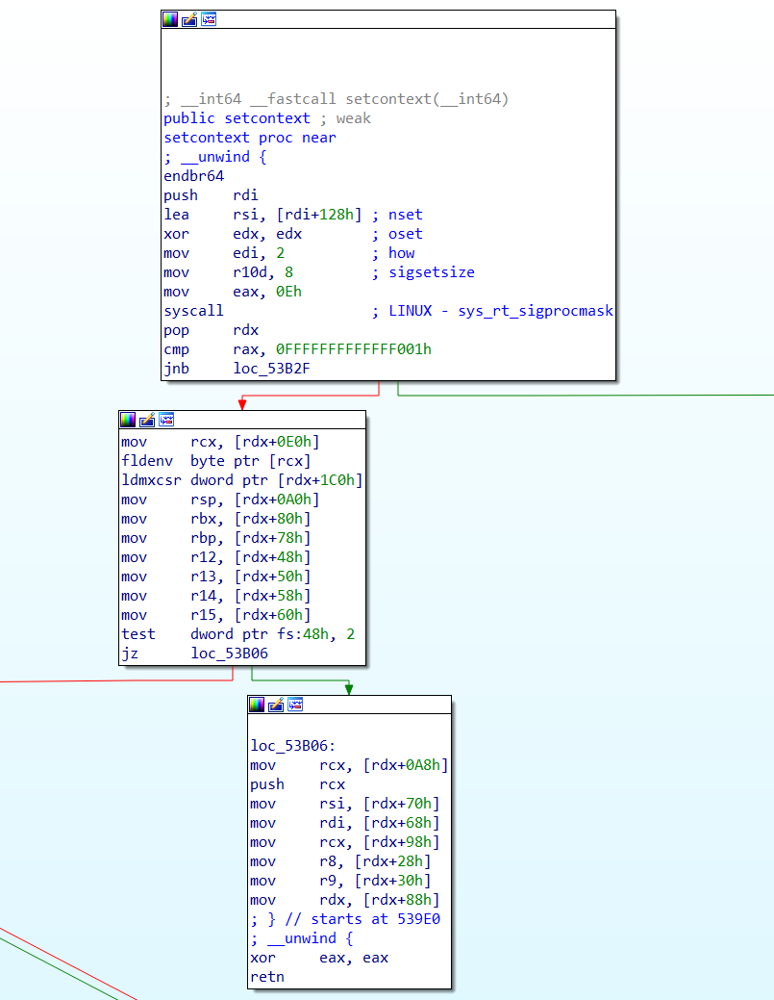
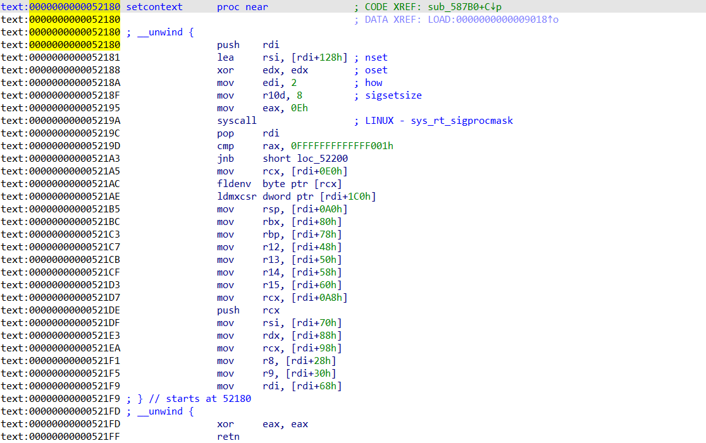
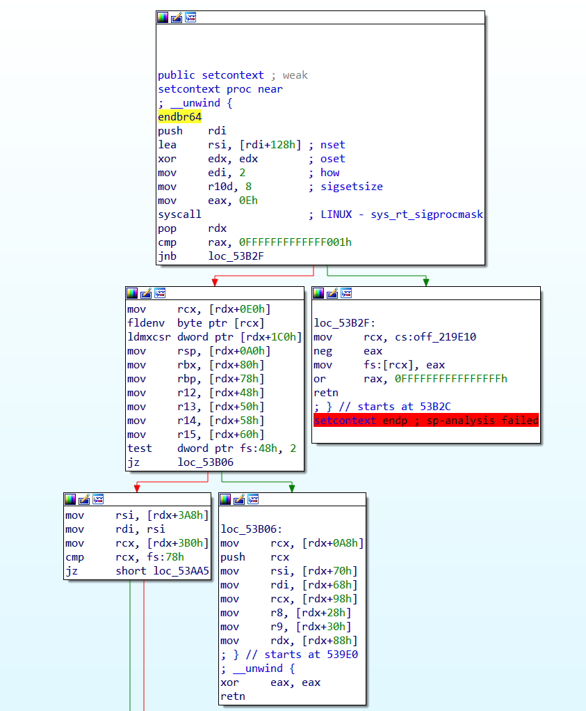
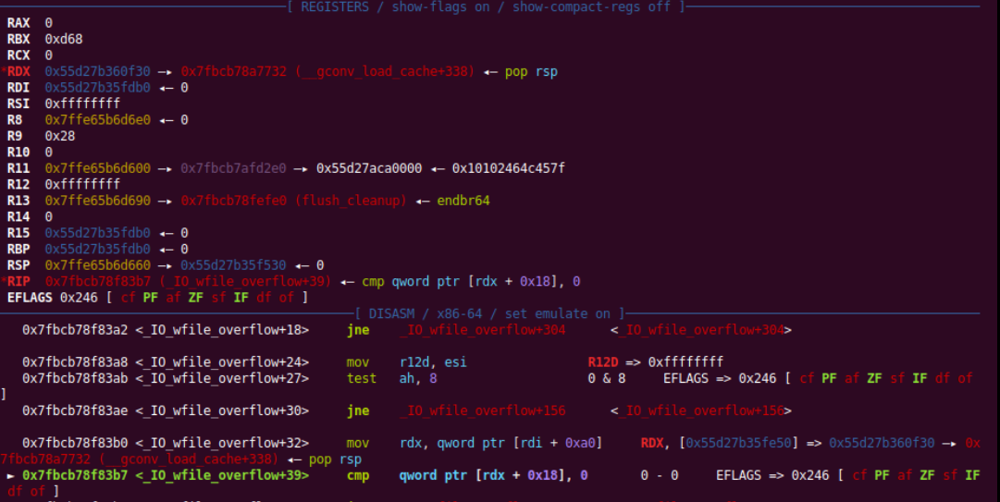
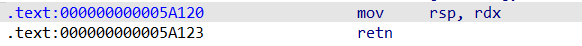

## 完成事项

刷题,自己找了点小比赛打了一下

## 未完成事项及原因

京麒ctf没打.当天上午早八考试,下午实验...

## 下周待做事项

## 本周学习的知识

在glibc中,有一个叫做setcontext的函数.它大概长这样:(图为glibc2.35)




可以看到,它会根据rdx寄存器存储的地址来给一系列寄存器赋值.

我们一般是在控制了rdx后,跳转到setcontext+61(mov     rsp, [rdx+0A0h])的位置,控制一系列寄存器.且由于控制了rsp,因此可以在ret后控制执行流.

那么问题来了,怎么控制rdx呢?

在堆利用中,rdx是不太好控制的的.但rdi寄存器一般都会指向一个可控的地址..所以我们现在需要另一个gadget,它能够将rdx控制为一个rdi相关的地址,并且还能跳转到setcontext这个gadget.

这个gadget长这样:

```assembly
0x167420: mov rdx, qword ptr [rdi + 8];
mov qword ptr [rsp], rax;
call qword ptr [rdx + 0x20];
```

可能在不同libc版本中有些出入.

这样,我们就可以用单次的任意地址跳转,达成控制函数的执行流的目的.在实际应用中一般用于orw.

最后是这个gadget在各个版本的差别:

libc2.27-:



可以直接用rdi,不需要那段gadget转换.另外偏移是+53

libc2.29

基本就是刚刚那幅图从rdi变成了rdx.

libc2.29~libc2.39



和libc2.35一样,偏移为+61(图为2.39)

另外高版本还有一个svcudp_reply+swapcontext的组合控制执行流.

另外,在house of apple 2的场景下,由于程序会用rdx寄存器来进行比较.



所以在执行最终调用时,rdx会指向_wide_data的开头.因此可以用这个gadget:




然后在_wide_data开头布置一个pop rsp +rop链地址即可.(至少在2.35这是有效的,其他版本的libc还没测试,听说2.37以上没法用)


最近又做了点高版本堆题,所以顺便整理了一下.


## 本周自己学习过程中遇到的问题和疑问点

## 情感、思考、观点

今天突然发现我上周的周报似乎编辑了没提交...点进去看是一片空白(悲)

## 在团队的感触和建议

